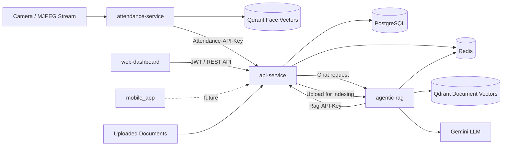
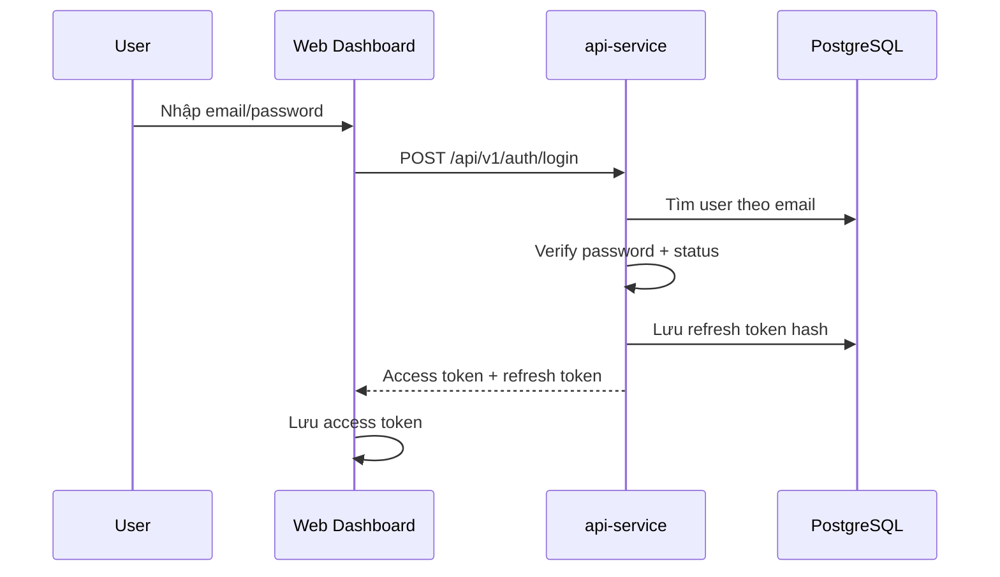
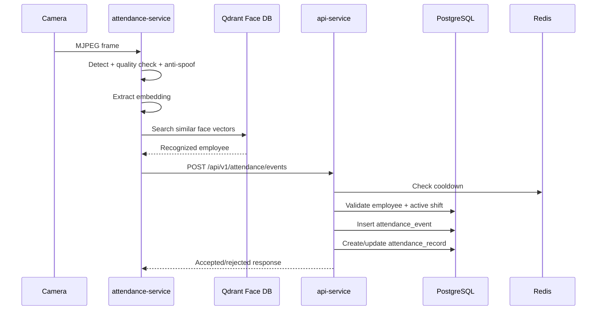
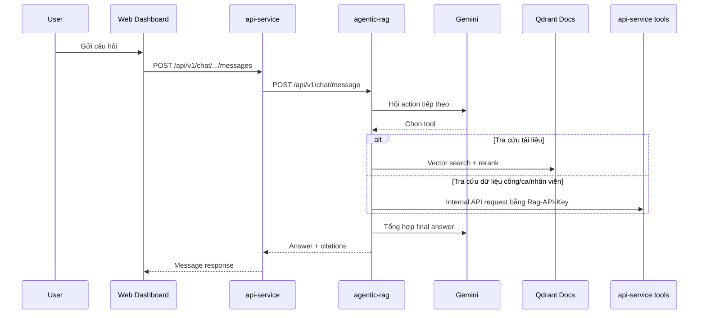

# Báo cáo sơ bộ dự án: Face Attendance Management System

**Ngày lập báo cáo:** 04/07/2026  
**Người thực hiện:** Nguyễn Thanh Phúc  
**Mục đích:** Tổng hợp hiện trạng dự án để báo cáo mentor, phục vụ trao đổi định hướng kỹ thuật, tiến độ hoàn thiện và các rủi ro cần xử lý.

---

## 1. Tổng quan dự án

Face Attendance Management System là hệ thống quản lý chấm công bằng nhận diện khuôn mặt, kết hợp các nghiệp vụ quản trị nhân sự, phân ca, theo dõi công, quản lý nghỉ phép và trợ lý hỏi đáp nội bộ dựa trên tài liệu công ty.

Dự án hiện được tổ chức theo mô hình nhiều service:

- **api-service:** Backend chính xử lý nghiệp vụ, xác thực, nhân sự, chấm công, ca làm, nghỉ phép, tài liệu và chat.
- **attendance-service:** Service AI xử lý camera, nhận diện khuôn mặt, chống giả mạo và gửi sự kiện chấm công về backend.
- **agentic-rag:** Service chatbot/RAG dùng Gemini, Qdrant và các tool nội bộ để trả lời câu hỏi về tài liệu, chấm công, nhân viên và ca làm.
- **web-dashboard:** Giao diện quản trị web cho HR/admin/manager/employee.
- **mobile_app:** Ứng dụng mobile Expo, hiện vẫn chủ yếu ở trạng thái starter/template.
- **infrastructure:** Cấu hình môi trường local gồm PostgreSQL, Redis và Qdrant.
- **visualize-attendance:** Trang HTML/CSS/JS đơn giản để xem camera stream và điều khiển worker chấm công.

---

## 2. Bài toán dự án giải quyết

Trong nhiều doanh nghiệp, việc chấm công thủ công hoặc bằng thẻ có các hạn chế:

- Dễ gian lận, ví dụ chấm công hộ.
- Khó kiểm soát ca làm, đi trễ, về sớm, thiếu check-in/check-out.
- HR mất nhiều thời gian tổng hợp bảng công.
- Nhân viên khó tự tra cứu thông tin công, ca làm hoặc chính sách nội bộ.
- Tài liệu quy định công ty rời rạc, khó tìm kiếm.

Dự án giải quyết các vấn đề trên bằng cách:

- Nhận diện khuôn mặt để ghi nhận chấm công tự động.
- Có chống giả mạo cơ bản bằng anti-spoofing.
- Lưu raw attendance event và attendance record chính thức riêng biệt.
- Quản lý nhân viên, phòng ban, chức vụ, ca làm và phân ca.
- Cung cấp dashboard cho HR/admin/manager.
- Cung cấp chatbot nội bộ có khả năng tra cứu tài liệu và dữ liệu hệ thống.

---

## 3. Kiến trúc tổng thể



### 3.1. Vai trò từng thành phần

| Thành phần | Vai trò |
|---|---|
| `api-service` | Backend nghiệp vụ trung tâm, quản lý DB, auth, nhân sự, chấm công, tài liệu, chat |
| `attendance-service` | Xử lý camera, detect face, quality check, anti-spoofing, embedding, identify nhân viên |
| `agentic-rag` | Chatbot nội bộ, tìm kiếm tài liệu, gọi tool lấy dữ liệu từ backend |
| `web-dashboard` | Giao diện quản trị và cổng thao tác chính |
| `mobile_app` | App mobile dự kiến cho nhân viên, hiện chưa hoàn thiện nghiệp vụ |
| PostgreSQL | Lưu dữ liệu nghiệp vụ chính |
| Redis | Cache/session, blacklist token, pending state của agent, cooldown |
| Qdrant | Vector database cho face embeddings và document embeddings |

---

## 4. Công nghệ sử dụng

### 4.1. Backend chính: `api-service`

- Python 3.10
- FastAPI
- Uvicorn
- SQLAlchemy async
- Alembic
- PostgreSQL
- Redis
- Pydantic v2 / pydantic-settings
- httpx
- python-jose JWT
- passlib bcrypt
- FastAPI-Mail
- python-multipart

### 4.2. AI service: `attendance-service`

- FastAPI
- OpenCV
- NumPy
- InsightFace
- ONNX model weights
- Anti-spoofing model từ thư mục `Silent-Face-Anti-Spoofing`
- Qdrant async client
- ThreadPoolExecutor để chạy inference không block event loop

### 4.3. RAG service: `agentic-rag`

- FastAPI
- Gemini API qua `google-generativeai`
- Qdrant
- Redis
- Embedding service
- Reranker service
- Tool-based ReAct agent loop
- SSE streaming response

Ghi chú: `agentic-rag/requirements.txt` và `agentic-rag/pyproject.toml` hiện đang rỗng, nên dependency của service này đang được suy ra từ import thay vì khai báo đầy đủ.

### 4.4. Web dashboard

- React 19
- Vite
- TypeScript
- React Router
- TanStack Query
- Axios
- Zustand
- React Hook Form
- Zod

### 4.5. Mobile app

- Expo
- Expo Router
- React Native
- TypeScript

Hiện mobile app còn ở mức template, chưa tích hợp đầy đủ nghiệp vụ dự án.

---

## 5. Cấu trúc thư mục chính

```text
FaceAttendanceManagementSystem/
├── api-service/              # Backend nghiệp vụ chính
├── attendance-service/       # AI face recognition + attendance worker
├── agentic-rag/              # Chatbot RAG + agent tools
├── web-dashboard/            # React admin dashboard
├── mobile_app/               # Expo mobile app
├── infrastructure/           # Docker compose, local infra
├── monitoring/               # Placeholder cho Prometheus/Grafana
├── tool/                     # Tool phụ trợ, ví dụ fake camera server
├── visualize-attendance/     # Viewer đơn giản cho attendance stream
├── BAO_CAO_CHI_TIET_DU_AN.md # Báo cáo chi tiết đã có
└── CLAUDE_CODE_AUTH_REPORT.md
```

---

## 6. Phân tích `api-service`

`api-service` là trung tâm nghiệp vụ của hệ thống.

### 6.1. Startup flow

File chính: `api-service/src/main.py`

Khi khởi động, service thực hiện:

1. Load settings từ `.env`.
2. Tạo Redis async client.
3. Kiểm tra kết nối Redis.
4. Kiểm tra kết nối PostgreSQL.
5. Kiểm tra timezone DB.
6. Chạy bootstrap admin nếu được bật.
7. Tạo HTTP client tới `attendance-service`.
8. Tạo HTTP client tới `agentic-rag`.
9. Mount router `/api/v1`.
10. Mount static files `/uploads`.

### 6.2. Các nhóm module chính

| Module | Chức năng |
|---|---|
| `auth` | Login, refresh token, logout, change password, reset password OTP |
| `users` | User account, role, status |
| `staff/employees` | Hồ sơ nhân viên |
| `staff/departments` | Phòng ban |
| `staff/position` | Chức vụ |
| `shifts` | Ca làm, phân ca |
| `attendance` | Raw event và record chấm công chính thức |
| `face_profiles` | Hồ sơ khuôn mặt của nhân viên |
| `employee_onboarding` | Quy trình đăng ký nhân viên/khuôn mặt |
| `leaves` | Nghỉ phép |
| `documents` | Quản lý tài liệu nội bộ |
| `chat` | Conversation, message, proxy sang RAG |
| `uploads_avartar` | Upload avatar |

Một số module có model/service nhưng chưa được mount vào router chính:

- `reports`
- `audit`
- `corrections`
- `notifications`
- `system`

### 6.3. Auth hiện tại

Auth dùng:

- Access token JWT.
- Refresh token dạng random token, lưu hash trong DB.
- `token_version` để revoke token hàng loạt.
- Redis blacklist access token khi logout.
- Role-based dependency qua `require_roles`.
- API key nội bộ:
  - `Attendance-API-Key` cho AI service.
  - `Rag-API-Key` cho RAG service.

Các endpoint auth chính:

- `POST /api/v1/auth/login`
- `POST /api/v1/auth/refresh`
- `POST /api/v1/auth/logout`
- `GET /api/v1/auth/me`
- `POST /api/v1/auth/change-password`
- `POST /api/v1/auth/password-reset/request-otp`
- `POST /api/v1/auth/password-reset/verify-otp`
- `POST /api/v1/auth/password-reset/confirm`

### 6.4. Model nghiệp vụ quan trọng

#### User và Role

- `users`: tài khoản đăng nhập.
- `roles`: vai trò như admin, hr, manager, employee.
- User liên kết 1-1 với Employee.

#### Staff

- `employees`: bảng trung tâm của hệ thống.
- `departments`: phòng ban.
- `positions`: chức vụ.
- `department_managers`: mapping manager phụ trách phòng ban.

#### Shift

- `work_shifts`: định nghĩa ca làm.
- `employee_shift_assignments`: phân ca theo khoảng ngày hiệu lực.
- `holidays`: ngày lễ.

#### Attendance

- `attendance_events`: log gốc từ AI service, không nên chỉnh sửa.
- `attendance_records`: bản ghi công chính thức, dùng cho HR xem và chỉnh.

Điểm thiết kế tốt: hệ thống tách raw event và record chính thức. Điều này giúp audit và debug tốt hơn.

---

## 7. Phân tích `attendance-service`

`attendance-service` là service AI xử lý nhận diện khuôn mặt và ghi nhận sự kiện chấm công.

### 7.1. Startup flow

File chính: `attendance-service/app/main.py`

Khi khởi động:

1. Tạo `ThreadPoolExecutor` để chạy ML inference.
2. Load detector, embedder và anti-spoofing model.
3. Warmup pipeline.
4. Kết nối Qdrant.
5. Tạo collection vector nếu chưa có.
6. Tạo `RegisterService` cho face enrollment.
7. Tạo HTTP client gọi về `api-service`.
8. Tạo `AttendancePipeline` để đọc camera stream.
9. Nếu `attendance_enabled=True`, tự động start worker.

### 7.2. Face processing pipeline

File chính: `attendance-service/app/core/pipeline/pipe_processor.py`

Luồng xử lý một frame:

1. Kiểm tra input image hợp lệ.
2. Detect khuôn mặt.
3. Yêu cầu đúng 1 khuôn mặt trong frame.
4. Kiểm tra landmark.
5. Kiểm tra kích thước mặt.
6. Kiểm tra detection score.
7. Kiểm tra blur, brightness, yaw, occlusion.
8. Chạy anti-spoofing.
9. Align face.
10. Trích xuất embedding.

### 7.3. Attendance worker

File chính: `attendance-service/app/core/pipeline/attendance_pipline.py`

Worker thực hiện:

1. Đọc frame mới nhất từ MJPEG camera.
2. Chạy pipeline nhận diện.
3. Tìm nhân viên trong Qdrant bằng embedding.
4. Xác nhận cùng một người qua nhiều frame liên tiếp.
5. Kiểm tra cooldown local.
6. Gửi attendance event về `api-service`.
7. Cập nhật trạng thái mới nhất để UI stream hiển thị.

### 7.4. API surface

Các endpoint chính:

- `GET /api/v1/attendance/status`
- `POST /api/v1/attendance/start`
- `POST /api/v1/attendance/stop`
- `GET /api/v1/attendance/stream`
- `POST /api/v1/faces/enroll/photo`
- `POST /api/v1/faces/enroll/commit`
- `POST /api/v1/faces/enroll/re-enroll`
- `DELETE /api/v1/faces/enroll/{session_id}`
- `DELETE /api/v1/faces/{staff_id}`
- `PATCH /api/v1/faces/{staff_id}/deactivate`
- `PATCH /api/v1/faces/{staff_id}/activate`
- `GET /api/v1/faces/{staff_id}/status`

---

## 8. Phân tích `agentic-rag`

`agentic-rag` là service chatbot dùng RAG và tool calling để hỗ trợ người dùng.

### 8.1. Startup flow

File chính: `agentic-rag/src/main.py`

Khi khởi động:

1. Cấu hình logging.
2. Kết nối Redis.
3. Khởi tạo embedding client/service.
4. Warmup embedding model.
5. Kết nối Qdrant.
6. Đảm bảo collection tài liệu tồn tại.
7. Khởi tạo vector store.
8. Khởi tạo reranker client/service.
9. Warmup reranker.
10. Tạo ingestion pipeline.
11. Tạo HTTP client gọi về `api-service`.
12. Lưu các service vào `app.state`.

### 8.2. Chat flow

Endpoint:

- `POST /api/v1/chat/message`
- `POST /api/v1/chat/message/stream`

Luồng xử lý:

1. Nhận `ChatRequest` từ `api-service`.
2. Tạo per-request `ToolRegistry`.
3. Đăng ký các tool:
   - `vector_search`
   - `employee_query`
   - `shift_query`
   - `attendance_query`
   - `ask_user`
4. `Supervisor` chạy vòng ReAct.
5. LLM chọn action.
6. `Executor` validate input và chạy tool.
7. Kết quả tool được đưa lại vào state.
8. Agent trả lời cuối cùng hoặc yêu cầu thêm thông tin.

### 8.3. RAG document flow

Endpoint:

- `POST /api/v1/rag/documents`
- `DELETE /api/v1/rag/documents/{document_id}/vectors`

Luồng ingest tài liệu:

1. Nhận file upload từ `api-service`.
2. Load nội dung theo loại file.
3. Chunk tài liệu bằng legal structure-aware chunker.
4. Tạo embedding.
5. Index vào Qdrant.
6. Lưu metadata như `document_id`, `filename`, `file_path`, `allowed_roles`.

### 8.4. Điểm mạnh

- Có phân quyền tài liệu theo role.
- Có citation cho câu trả lời.
- Có tool gọi dữ liệu thật từ backend.
- Có streaming response qua SSE.
- Có pending state trong Redis cho trường hợp agent cần hỏi lại người dùng.

---

## 9. Phân tích `web-dashboard`

`web-dashboard` là giao diện quản trị chính.

### 9.1. Stack

- React
- TypeScript
- Vite
- React Router
- TanStack Query
- Axios
- Zustand
- React Hook Form
- Zod

### 9.2. Kiến trúc frontend

Frontend dùng cấu trúc feature-based:

```text
src/
├── app/
├── components/
├── constants/
├── features/
│   ├── auth/
│   ├── employees/
│   ├── departments/
│   ├── positions/
│   ├── shifts/
│   ├── attendance/
│   ├── face-profiles/
│   ├── employee-onboarding/
│   ├── documents/
│   ├── chatbox/
│   └── leave/
├── lib/
├── stores/
├── styles/
└── types/
```

Mỗi feature thường có:

- `api`
- `hooks`
- `types`
- `schemas`
- `components`
- `pages`

### 9.3. Routing và phân quyền

File chính: `web-dashboard/src/app/router.tsx`

Các trang chính:

- Dashboard
- Employees
- Departments
- Positions
- Shifts
- Face Profiles
- Employee Onboarding
- Attendance
- Leave
- Corrections
- Audit Logs
- Notifications
- Documents
- Chatbox
- Settings

Frontend có:

- `ProtectedRoute` để kiểm tra login.
- `RoleRoute` để kiểm tra role.
- Auth store bằng Zustand.
- Access token lưu qua `tokenStorage`.
- Axios interceptor tự gắn `Authorization: Bearer <token>`.

---

## 10. Phân tích `mobile_app`

`mobile_app` hiện là Expo app với file-based routing.

Hiện trạng:

- Đã có Expo Router.
- Đã có theme constants và component starter.
- Màn hình chính vẫn là nội dung mặc định của Expo.
- Chưa có module auth, attendance, leave, chat hoặc profile thật.

Định hướng phát triển:

- Login/logout.
- Xem profile nhân viên.
- Xem lịch sử chấm công.
- Check-in/check-out nếu mobile được hỗ trợ.
- Xem ca làm hiện tại.
- Gửi đơn nghỉ phép.
- Nhận thông báo.
- Chat với trợ lý nội bộ.

---

## 11. Cơ sở dữ liệu và dữ liệu chính

Hệ thống dùng PostgreSQL cho dữ liệu nghiệp vụ.

Các nhóm bảng quan trọng:

| Nhóm | Bảng tiêu biểu |
|---|---|
| Auth | `users`, `roles` |
| Staff | `employees`, `departments`, `positions`, `department_managers` |
| Shift | `work_shifts`, `employee_shift_assignments`, `holidays` |
| Attendance | `attendance_events`, `attendance_records` |
| Face | `face_profiles` |
| Leave | `leave_requests`, `leave_types`, `leave_approval_logs` |
| Corrections | `attendance_correction_requests`, `attendance_correction_logs` |
| Documents | `documents` |
| Chat | `conversations`, `chat_messages` |
| Audit/Notification/System | `audit_logs`, `notifications`, `system_settings` |

Migration được quản lý bằng Alembic trong `api-service/alembic`.

---

## 12. Hạ tầng local

File local compose chính: `infrastructure/compose/docker-compose.dev.yml`

Các service:

- PostgreSQL 16
- Redis 7
- Qdrant

Các port local:

- PostgreSQL: host `5433` mapping vào container `5432`
- Redis: `6379`
- Qdrant: `6333`

Ghi chú:

- `docker-compose.prod.yml` hiện đang rỗng.
- Các Dockerfile trong `infrastructure/docker` hiện đang rỗng.
- Một số file monitoring như `prometheus.yml`, `rules.yml`, `monitoring/README.md` hiện cũng đang rỗng.

---

## 13. Luồng nghiệp vụ chính

### 13.1. Luồng đăng nhập



### 13.2. Luồng chấm công bằng khuôn mặt



### 13.3. Luồng chat nội bộ



---

## 14. Tiến độ hiện tại

### 14.1. Đã có

- Backend chính FastAPI đã có cấu trúc rõ.
- Auth đã có login, refresh, logout, reset password OTP.
- Quản lý nhân viên, phòng ban, chức vụ.
- Quản lý ca làm và phân ca.
- Ghi nhận attendance event từ AI service.
- Xử lý attendance record chính thức.
- AI service có face detection, anti-spoofing, embedding, face vector DB.
- Có flow enrollment khuôn mặt.
- Có RAG service với agent/tool architecture.
- Web dashboard đã có nhiều feature page.
- Có local compose cho PostgreSQL, Redis, Qdrant.

### 14.2. Chưa hoàn thiện hoặc cần kiểm tra thêm

- Thiếu test source trong repo.
- `agentic-rag` chưa khai báo dependencies chính thức.
- `attendance-service/requirements.txt` đang rỗng.
- Dockerfile và production compose đang rỗng.
- Monitoring config đang rỗng hoặc chưa hoàn thiện.
- Mobile app chưa có nghiệp vụ thật.
- Một số module backend có file nhưng chưa mount vào router chính.
- Cần kiểm tra thêm tính ổn định của refresh token, reset OTP và rate limit.
- Cần audit lại naming typo như `respone.py`, `dependenci.py`, `exeptions.py`, `attendance_pipline.py`.

---

## 15. Rủi ro kỹ thuật

| Rủi ro | Mức độ | Ghi chú |
|---|---:|---|
| Thiếu test tự động | Cao | Khó đảm bảo không regression khi chỉnh nghiệp vụ |
| Dependency chưa khai báo đủ | Cao | Khó deploy/reproduce môi trường |
| Docker/production config rỗng | Cao | Chưa sẵn sàng triển khai production |
| Secrets/local credentials trong compose hoặc `.env` | Trung bình | Cần chuẩn hóa quản lý secrets |
| Một số module chưa mount router | Trung bình | Có thể gây lệch giữa frontend và backend |
| ML inference phụ thuộc model weight/local device | Trung bình | Cần kiểm tra GPU/CPU, latency, fallback |
| RAG phụ thuộc Gemini API và model local | Trung bình | Cần timeout/retry/cost monitoring |
| Mobile app chưa tích hợp nghiệp vụ | Thấp/Trung bình | Tùy scope đồ án |

---

## 16. Đánh giá coding convention

### 16.1. Điểm tốt

- Backend chia theo feature tương đối rõ.
- Service/repository/schema/controller được tách riêng ở nhiều module.
- Dùng async SQLAlchemy phù hợp với FastAPI.
- Có dependency injection qua FastAPI.
- Có `app.state` để chia sẻ tài nguyên runtime.
- Có role-based access control.
- Có tách raw event và official record trong attendance.
- Frontend dùng feature-based architecture rõ ràng.
- Frontend có React Query và custom hooks theo feature.

### 16.2. Điểm cần cải thiện

- Chuẩn hóa tên file bị typo.
- Bổ sung test.
- Bổ sung README chạy từng service.
- Chuẩn hóa dependency file.
- Bổ sung lint/format config cho Python.
- Bổ sung API contract hoặc OpenAPI export cho frontend.
- Tách rõ config dev/prod.
- Hoàn thiện Dockerfile và compose production.

---

## 17. Kế hoạch đề xuất tiếp theo

### Giai đoạn 1: Ổn định nền tảng

- Hoàn thiện dependency files cho `agentic-rag` và `attendance-service`.
- Viết README chạy local toàn hệ thống.
- Chuẩn hóa `.env.example` cho từng service.
- Hoàn thiện Dockerfile cho backend, AI service, RAG service và web dashboard.
- Hoàn thiện `docker-compose.prod.yml` hoặc compose staging.

### Giai đoạn 2: Kiểm thử nghiệp vụ chính

- Viết test cho auth:
  - login
  - refresh
  - logout
  - change password
  - reset password OTP
- Viết test cho attendance:
  - check-in lần đầu
  - check-out
  - duplicate/cooldown
  - employee inactive
  - no active shift
  - overnight shift
- Viết test cho phân quyền role.

### Giai đoạn 3: Hoàn thiện dashboard

- Kiểm tra mapping endpoint giữa frontend và backend.
- Hoàn thiện các trang còn placeholder.
- Hoàn thiện error/loading/empty states.
- Kiểm tra role route theo nghiệp vụ thật.

### Giai đoạn 4: Hoàn thiện RAG/chatbot

- Khai báo dependency chính thức.
- Thêm eval dataset cơ bản.
- Kiểm tra citation và role-based document access.
- Thêm logging/cost tracking rõ hơn.
- Tối ưu prompt và tool schema.

### Giai đoạn 5: Mobile app hoặc production readiness

Tùy scope mentor yêu cầu:

- Nếu ưu tiên mobile: xây dựng auth, profile, attendance history, leave, chat.
- Nếu ưu tiên deploy: hoàn thiện Docker, monitoring, CI, backup DB, secrets management.

---

## 18. Demo đề xuất cho mentor

Một demo ngắn có thể đi theo thứ tự:

1. Mở web dashboard và đăng nhập.
2. Xem danh sách nhân viên/phòng ban/chức vụ.
3. Tạo hoặc kiểm tra ca làm.
4. Xem hồ sơ khuôn mặt/employee onboarding.
5. Start attendance worker.
6. Cho camera nhận diện khuôn mặt.
7. Xem attendance event/record được ghi nhận.
8. Upload tài liệu nội bộ.
9. Hỏi chatbot một câu về chính sách hoặc dữ liệu chấm công.

---

## 19. Câu hỏi cần mentor góp ý

- Scope đồ án nên ưu tiên web dashboard hay mobile app?
- Có cần triển khai production thật hay chỉ demo local?
- Có cần đánh giá accuracy của face recognition bằng dataset riêng không?
- Phần RAG có cần citation bắt buộc cho mọi câu trả lời không?
- Có cần bổ sung báo cáo thống kê attendance nâng cao không?
- Có yêu cầu bảo mật cụ thể cho dữ liệu khuôn mặt không?
- Có cần chuẩn hóa kiến trúc microservice hoặc gom service để dễ deploy hơn không?

---

## 20. Kết luận

Dự án Face Attendance Management System hiện đã có nền tảng tương đối đầy đủ cho một hệ thống chấm công nhận diện khuôn mặt: backend nghiệp vụ, AI recognition service, RAG chatbot và web dashboard. Kiến trúc đã tách service rõ ràng, có sử dụng PostgreSQL, Redis và Qdrant phù hợp với bài toán.

Các phần nổi bật của dự án gồm:

- Nhận diện khuôn mặt và chống giả mạo.
- Ghi nhận chấm công tự động.
- Quản lý nhân sự, phòng ban, chức vụ, ca làm.
- Tách raw attendance event và official attendance record.
- Chatbot nội bộ có thể tra cứu tài liệu và dữ liệu hệ thống.
- Web dashboard theo feature-based architecture.

Các điểm cần ưu tiên tiếp theo là hoàn thiện dependency/deployment, bổ sung test, chuẩn hóa tài liệu chạy dự án và hoàn thiện các module còn placeholder. Nếu các phần này được xử lý tốt, dự án có thể trình bày như một hệ thống end-to-end khá hoàn chỉnh cho bài toán quản lý chấm công bằng AI.
