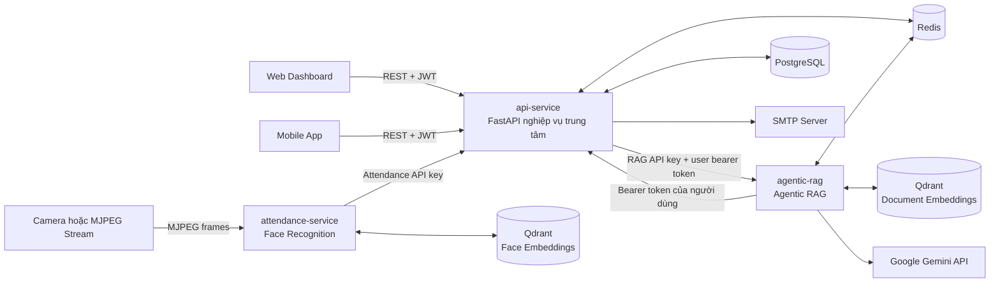
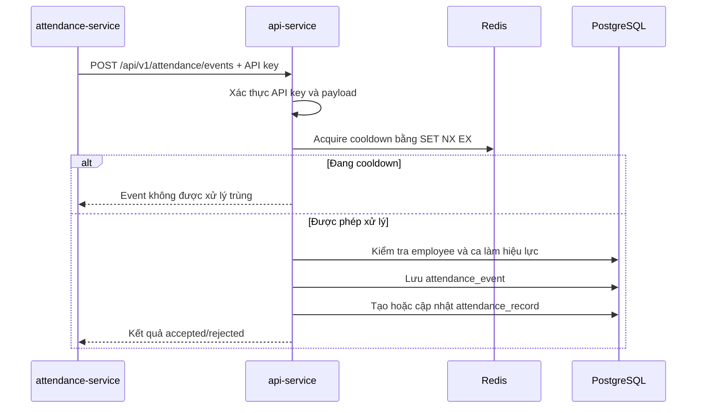
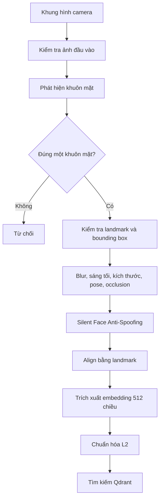
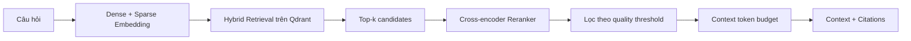
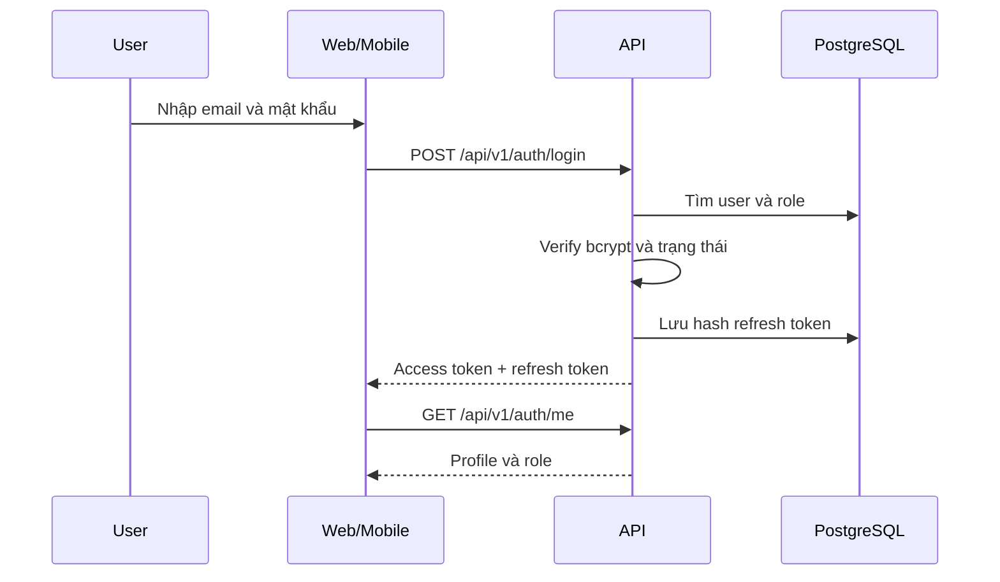
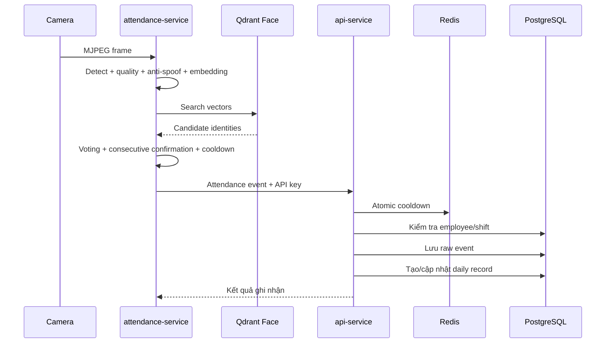
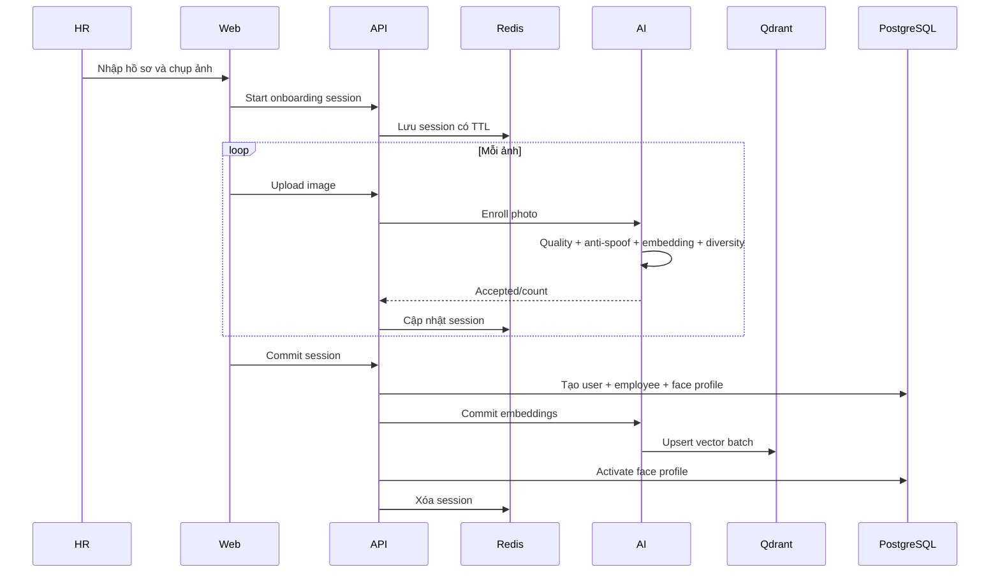
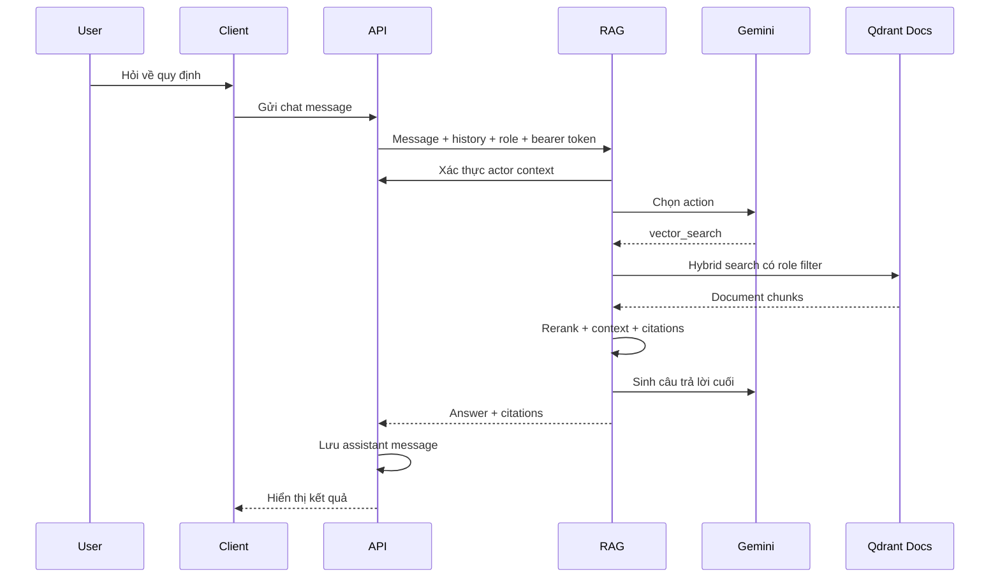
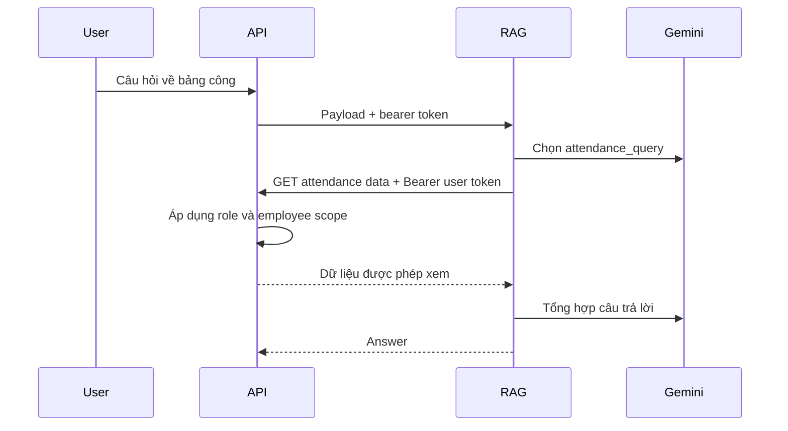

# BÁO CÁO TỔNG HỢP DỰ ÁN FACE ATTENDANCE MANAGEMENT SYSTEM

> **Mục đích tài liệu:** Cung cấp nguồn tri thức chi tiết, có cấu trúc và bám sát mã nguồn để chatbot hỗ trợ viết tiểu luận, báo cáo đồ án, thuyết trình và chuẩn bị nội dung bảo vệ.
>
> **Thời điểm đối chiếu mã nguồn:** 07/08/2026.
>
> **Phạm vi:** Toàn bộ monorepo gồm backend nghiệp vụ, dịch vụ nhận diện khuôn mặt, dịch vụ Agentic RAG, web dashboard, ứng dụng mobile, hạ tầng và công cụ hỗ trợ.

---

## 1. Hướng dẫn sử dụng tài liệu cho chatbot

Khi sử dụng tài liệu này để viết tiểu luận, chatbot cần tuân thủ các nguyên tắc sau:

1. Xem đây là tài liệu mô tả **hiện trạng kỹ thuật của mã nguồn**, không phải tài liệu quảng cáo sản phẩm.
2. Phân biệt rõ ba trạng thái:
   - **Đã triển khai trong mã nguồn:** Có module, luồng xử lý hoặc endpoint cụ thể.
   - **Đã có nền tảng nhưng chưa hoàn thiện:** Có mã nguồn nhưng còn thiếu kiểm thử, cấu hình triển khai hoặc giao diện đầy đủ.
   - **Định hướng phát triển:** Chưa nên mô tả như tính năng đã hoàn thành.
3. Không tự suy diễn các số liệu như độ chính xác nhận diện, thời gian phản hồi, số người dùng đồng thời hoặc tỷ lệ hoàn thành nếu chưa có kết quả đo thực nghiệm.
4. Không khẳng định hệ thống đã sẵn sàng cho production vì cấu hình production, monitoring và đóng gói một số service chưa hoàn chỉnh.
5. Không đưa giá trị bí mật trong các file `.env` vào báo cáo. Chỉ mô tả tên nhóm cấu hình và mục đích sử dụng.
6. Khi viết học thuật, có thể diễn đạt lại nội dung nhưng phải giữ đúng bản chất kiến trúc, công nghệ và luồng nghiệp vụ được mô tả trong tài liệu này.
7. Hai file `BAO_CAO_SO_BO_DU_AN.md` và `BAO_CAO_CHI_TIET_DU_AN.md` được tạo ở thời điểm trước và có một số thông tin đã lỗi thời. Mã nguồn hiện tại và tài liệu tổng hợp này được ưu tiên sử dụng.

---

## 2. Tóm tắt đề tài

**Face Attendance Management System** là hệ thống quản lý nhân sự và chấm công được xây dựng theo kiến trúc nhiều dịch vụ. Hệ thống kết hợp ba nhóm chức năng chính:

- Quản lý nhân sự, tài khoản, phòng ban, chức vụ, ca làm việc, nghỉ phép, sửa công, báo cáo và nhật ký hoạt động.
- Chấm công tự động bằng nhận diện khuôn mặt, có kiểm tra chất lượng ảnh và chống giả mạo.
- Trợ lý Agentic RAG hỗ trợ tra cứu tài liệu nội bộ và dữ liệu nghiệp vụ theo quyền của người dùng.

Hệ thống có hai ứng dụng người dùng:

- Web dashboard dành chủ yếu cho `admin`, `hr` và `manager`.
- Ứng dụng mobile dành cho `employee`.

Backend nghiệp vụ trung tâm là `api-service`. Dữ liệu quan hệ được lưu trong PostgreSQL; Redis được dùng cho trạng thái ngắn hạn, thu hồi token, giới hạn và chống trùng; Qdrant được dùng cho vector khuôn mặt và vector tài liệu. Dịch vụ nhận diện khuôn mặt và dịch vụ RAG hoạt động độc lập nhưng giao tiếp với backend bằng HTTP và cơ chế xác thực nội bộ.

---

## 3. Bối cảnh và lý do chọn đề tài

Trong hoạt động quản trị doanh nghiệp, chấm công và quản lý nhân sự là các nghiệp vụ diễn ra thường xuyên, ảnh hưởng trực tiếp đến đánh giá ngày công, kỷ luật lao động và quyền lợi của nhân viên. Các phương pháp chấm công thủ công, thẻ từ hoặc mã số có thể gặp những hạn chế như:

- Có nguy cơ chấm công hộ.
- Dữ liệu dễ sai lệch hoặc khó truy vết khi có tranh chấp.
- Nhân sự mất nhiều thời gian tổng hợp và điều chỉnh bảng công.
- Khó kết hợp dữ liệu chấm công với ca làm việc, ngày lễ và đơn nghỉ phép.
- Nhân viên phải liên hệ trực tiếp với HR khi cần tra cứu quy định hoặc dữ liệu cá nhân.
- Tài liệu nội bộ thường phân tán và khó tìm bằng phương pháp tìm kiếm từ khóa đơn giản.

Đề tài được xây dựng nhằm áp dụng nhận diện khuôn mặt, cơ sở dữ liệu vector và mô hình ngôn ngữ lớn vào một bài toán quản trị có luồng nghiệp vụ cụ thể. Điểm trọng tâm không chỉ là mô hình AI mà còn là khả năng tích hợp AI với xác thực, phân quyền, cơ sở dữ liệu, giao diện và các quy trình nhân sự.

---

## 4. Mục tiêu của hệ thống

### 4.1. Mục tiêu tổng quát

Xây dựng một hệ thống quản lý nhân sự tích hợp chấm công bằng khuôn mặt và trợ lý hỏi đáp thông minh, có khả năng quản lý dữ liệu tập trung, giảm thao tác thủ công và bảo vệ dữ liệu theo vai trò người dùng.

### 4.2. Mục tiêu cụ thể

- Quản lý tài khoản và bốn vai trò: `admin`, `hr`, `manager`, `employee`.
- Quản lý hồ sơ nhân viên, phòng ban, chức vụ và quan hệ quản lý.
- Quản lý ca làm việc, lịch phân ca và ngày lễ.
- Đăng ký hồ sơ khuôn mặt bằng nhiều ảnh đạt chất lượng.
- Nhận diện khuôn mặt từ camera và ghi nhận sự kiện chấm công.
- Tách dữ liệu sự kiện thô khỏi bảng công chính thức để thuận tiện kiểm tra và điều chỉnh.
- Quản lý nghỉ phép và yêu cầu sửa công theo quy trình xét duyệt.
- Tổng hợp báo cáo chấm công và nghỉ phép.
- Quản lý tài liệu nội bộ có danh sách vai trò được phép truy cập.
- Cho phép trợ lý RAG tra cứu tài liệu và dữ liệu thật từ hệ thống.
- Cung cấp web dashboard cho quản trị và ứng dụng mobile cho nhân viên.

### 4.3. Đối tượng sử dụng

| Vai trò | Nhu cầu chính |
|---|---|
| `admin` | Quản trị tài khoản, phân quyền, tài liệu, tổ chức, ca làm, audit và toàn bộ dữ liệu |
| `hr` | Quản lý nhân viên, onboarding, khuôn mặt, ca làm, nghỉ phép, sửa công và báo cáo |
| `manager` | Theo dõi nhân viên thuộc phạm vi quản lý, chấm công nhóm, ca làm và quy trình xét duyệt |
| `employee` | Xem hồ sơ, ca làm, bảng công, gửi nghỉ phép/sửa công và sử dụng trợ lý AI |

---

## 5. Phạm vi chức năng

### 5.1. Chức năng đã có trong mã nguồn

- Đăng nhập, làm mới token, đăng xuất và lấy thông tin người dùng hiện tại.
- Đổi mật khẩu và khôi phục mật khẩu qua OTP email.
- Quản lý user, role, trạng thái và đặt lại mật khẩu bởi quản trị viên.
- Quản lý employee, department, position và department manager.
- Quản lý work shift, shift assignment và holiday.
- Quản lý attendance event, attendance record và thống kê tóm tắt.
- Quản lý face profile và quy trình employee onboarding.
- Quản lý leave type, leave balance, leave request và approval log.
- Quản lý attendance correction request và correction log.
- Các báo cáo tổng hợp chấm công, nghỉ phép, xếp hạng đi muộn và báo cáo tháng cá nhân.
- Audit log cho các thao tác cần theo dõi.
- Upload avatar và ảnh.
- Upload, tải xuống, cập nhật và xóa tài liệu RAG.
- Quản lý conversation, chat message và chuyển tiếp câu hỏi sang RAG.
- Nhận diện khuôn mặt, enrollment, kích hoạt/vô hiệu hóa và xóa vector khuôn mặt.
- Chat Agentic RAG bằng JSON hoặc SSE streaming.
- Web dashboard cho quản trị và mobile app cho nhân viên.

### 5.2. Chức năng có mã nguồn nhưng chưa được nối đầy đủ

- Module `notifications` và `system` tồn tại trong backend nhưng router của hai module chưa được đăng ký trong router chính.
- Trang notifications của web mới là giao diện “coming soon” và chưa có luồng API hoàn chỉnh.
- Settings có giao diện nhưng chưa tương ứng với một module system API đang hoạt động qua router chính.

### 5.3. Ngoài phạm vi hoặc chưa thể khẳng định

- Chưa có hệ thống tính lương hoàn chỉnh.
- Chưa có push notification native hoàn chỉnh.
- Chưa có cấu hình production đầy đủ.
- Chưa có số liệu kiểm chứng độ chính xác nhận diện trên một bộ dữ liệu đánh giá chuẩn.
- Chưa có kết quả kiểm thử tải hoặc khả năng mở rộng theo số người dùng.

---

## 6. Kiến trúc tổng thể

### 6.1. Mô hình kiến trúc



### 6.2. Nguyên tắc phân chia trách nhiệm

| Thành phần | Trách nhiệm |
|---|---|
| `api-service` | Nguồn dữ liệu nghiệp vụ chính, xác thực, phân quyền, điều phối AI/RAG |
| `attendance-service` | Xử lý ảnh, trích xuất embedding, nhận diện và tạo sự kiện chấm công |
| `agentic-rag` | Ingest tài liệu, truy xuất ngữ cảnh và điều phối các công cụ hỏi đáp |
| `web-dashboard` | Giao diện quản trị theo vai trò |
| `mobile_app` | Cổng tự phục vụ dành cho nhân viên |
| PostgreSQL | Dữ liệu quan hệ và trạng thái nghiệp vụ lâu dài |
| Redis | Trạng thái ngắn hạn, token blacklist, cooldown và pending agent |
| Qdrant | Tìm kiếm vector cho khuôn mặt và tài liệu |

Backend trung tâm không giao trách nhiệm phân quyền dữ liệu nghiệp vụ cho RAG. Khi agent cần đọc dữ liệu nhân viên, ca làm hoặc chấm công, RAG phải gọi lại `api-service` bằng access token đã được xác thực của chính người dùng. Thiết kế này giúp duy trì một nguồn chính sách phân quyền duy nhất.

---

## 7. Cấu trúc thư mục dự án

```text
FaceAttendanceManagementSystem/
├── api-service/               # Backend nghiệp vụ trung tâm
│   ├── src/api/v1/features/   # Các module nghiệp vụ
│   ├── src/core/              # DB, security, clients, middleware, cache
│   ├── alembic/               # Migration PostgreSQL
│   ├── tests/                 # Kiểm thử backend
│   └── uploads/               # Avatar và tài liệu lưu local
├── attendance-service/        # Dịch vụ AI khuôn mặt
│   ├── app/api/               # API attendance và enrollment
│   ├── app/core/ml/           # Detector, embedder, anti-spoofing
│   ├── app/core/pipeline/     # Pipeline frame và camera worker
│   ├── app/core/vector_db/    # Tích hợp Qdrant
│   ├── Silent-Face-Anti-Spoofing/
│   └── weights/               # Model weights
├── agentic-rag/               # Dịch vụ trợ lý AI
│   ├── src/agents/            # Supervisor, Executor, State
│   ├── src/rag/               # Ingestion và retrieval
│   ├── src/tools/             # Công cụ của agent
│   ├── src/integrations/      # Gemini, Redis, Qdrant, api-service
│   ├── tests/                 # Kiểm thử RAG
│   └── eval/                  # Dataset và kết quả đánh giá
├── web-dashboard/             # React/Vite dashboard
├── mobile_app/                # Expo/React Native app
├── infrastructure/            # Compose và Dockerfile
├── monitoring/                # Khung Prometheus/Grafana
├── visualize-attendance/      # UI xem stream AI đơn giản
└── tool/                      # Công cụ hỗ trợ camera
```

---

## 8. Công nghệ và thư viện chính

### 8.1. Backend nghiệp vụ

| Công nghệ | Vai trò |
|---|---|
| Python 3.10 | Ngôn ngữ backend theo khai báo Poetry |
| FastAPI 0.135.3 | Xây dựng REST API và dependency injection |
| Uvicorn 0.43.0 | ASGI server |
| SQLAlchemy 2.0.49 | ORM bất đồng bộ |
| asyncpg 0.31.0 | PostgreSQL async driver |
| Alembic 1.18.4 | Quản lý migration |
| Redis client 5.2.1 | Cache và trạng thái ngắn hạn |
| Pydantic 2.12.5 | Validation và serialization |
| HTTPX 0.28.1 | Giao tiếp service-to-service |
| python-jose | JWT |
| passlib + bcrypt | Băm và kiểm tra mật khẩu |
| FastAPI-Mail | Gửi email OTP |

### 8.2. Dịch vụ Agentic RAG

| Công nghệ | Vai trò |
|---|---|
| FastAPI | API chat và ingest tài liệu |
| Google Generative AI | Giao tiếp Gemini |
| FlagEmbedding/BGE-M3 | Sinh dense và sparse embedding |
| Transformers/Sentence Transformers | Hạ tầng mô hình embedding/reranking |
| Qdrant Client | Lưu và truy xuất vector tài liệu |
| Redis | Lưu pending state khi agent cần hỏi lại |
| PyPDF, python-docx | Đọc PDF và DOCX |
| PyTorch | Chạy embedding và reranker |

### 8.3. Dịch vụ nhận diện khuôn mặt

- FastAPI và Uvicorn.
- OpenCV và NumPy để đọc, xử lý ảnh.
- InsightFace để phát hiện/trích xuất đặc trưng khuôn mặt.
- ONNX model weights.
- Silent-Face-Anti-Spoofing để phát hiện giả mạo.
- Qdrant async client để lưu và tìm vector 512 chiều.
- ThreadPoolExecutor và lock để tránh block event loop và tranh chấp inference.

`attendance-service/requirements.txt` hiện đang rỗng, do đó môi trường của service này chưa thể tái tạo chỉ từ file dependency trong repo.

### 8.4. Web dashboard

- React 19.2.
- TypeScript 6.
- Vite 8.
- React Router 7.
- TanStack Query 5.
- Axios.
- Zustand.
- React Hook Form và Zod.
- React Compiler thông qua Babel/Rolldown plugin.

### 8.5. Mobile app

- Expo SDK 56.
- Expo Router.
- React Native 0.85.
- React 19.
- Axios và Zustand.
- Expo SecureStore.
- Expo Image Picker.
- Native tabs và hỗ trợ React Native Web.

---

## 9. Phân tích `api-service`

### 9.1. Vai trò

`api-service` là service quan trọng nhất của hệ thống. Đây là nơi sở hữu dữ liệu nghiệp vụ, thực hiện xác thực/phân quyền và điều phối các dịch vụ AI. Web và mobile đều giao tiếp với service này qua prefix `/api/v1`.

### 9.2. Luồng khởi động

Trong lifespan của ứng dụng, backend thực hiện:

1. Đọc cấu hình từ `api-service/.env` bằng Pydantic Settings.
2. Tạo Redis async client và kiểm tra `PING`.
3. Nếu Redis không cấu hình mật khẩu nhưng URL có password, service đóng client cũ và thử lại ở chế độ không AUTH.
4. Kiểm tra kết nối PostgreSQL bằng `SELECT 1`.
5. Đọc timezone của phiên PostgreSQL để ghi log.
6. Kiểm tra và tạo bootstrap admin nếu tính năng được bật và cấu hình hợp lệ.
7. Tạo HTTPX client dùng chung cho `attendance-service`.
8. Tạo HTTPX client dùng chung cho `agentic-rag`.
9. Đưa các client vào `app.state` để dependency sử dụng.
10. Khi shutdown, đóng lần lượt client RAG, client AI và Redis.

Ứng dụng cấu hình CORS, logging middleware, timing middleware, exception handlers, router `/api/v1`, health check và static route dành riêng cho avatar. Tài liệu không được public trực tiếp qua static route mà phải tải bằng endpoint có xác thực.

### 9.3. Kiến trúc module backend

Một feature điển hình gồm:

```text
controller.py  # HTTP route và dependency
schemas.py     # Pydantic request/response
service.py     # Quy tắc nghiệp vụ
repo.py        # Truy cập dữ liệu
models.py      # SQLAlchemy model
```

Một số module dùng tên `repository.py`, `user_repo.py`, `employee_repo.py` hoặc `face_profile_repo.py`. Tuy tên file chưa hoàn toàn đồng nhất, hướng phân lớp controller–service–repository vẫn là quy ước chính.

### 9.4. Danh sách module nghiệp vụ

| Module | Chức năng chính | Trạng thái router |
|---|---|---|
| `auth` | Login, refresh, logout, profile auth, đổi/reset mật khẩu | Đã đăng ký |
| `users` | Danh sách user, role, status, password admin | Đã đăng ký |
| `staff/employees` | Hồ sơ nhân viên và phạm vi nhân sự | Đã đăng ký |
| `staff/departments` | Phòng ban và manager phòng ban | Đã đăng ký |
| `staff/position` | Danh mục chức vụ | Đã đăng ký |
| `shifts` | Work shift, assignment, current shift, holiday | Đã đăng ký |
| `attendance` | Event thô, record chính thức, summary | Đã đăng ký |
| `face_profiles` | Trạng thái hồ sơ khuôn mặt | Đã đăng ký |
| `employee_onboarding` | Đăng ký tài khoản, nhân viên và khuôn mặt | Đã đăng ký |
| `leaves` | Loại phép, số dư, đơn và xét duyệt | Đã đăng ký |
| `corrections` | Yêu cầu sửa công và log | Đã đăng ký |
| `reports` | Báo cáo chấm công/nghỉ phép | Đã đăng ký |
| `audit` | Ghi và đọc audit log | Đã đăng ký |
| `documents` | Lưu file và đồng bộ vector RAG | Đã đăng ký |
| `chat` | Conversation, message và proxy RAG | Đã đăng ký |
| `uploads_avartar` | Upload avatar/image | Đã đăng ký |
| `notifications` | Model/service notification | Chưa đăng ký |
| `system` | System settings | Chưa đăng ký |

### 9.5. Xác thực và quản lý phiên

#### Access token

Access token là JWT chứa các trường quan trọng:

- `sub`: ID của user.
- `role`: vai trò tại thời điểm phát hành.
- `token_version`: phiên bản token của user.
- `jti`: định danh duy nhất của token.
- `type`: phải là `access`.
- `iss`, `aud`, `iat`, `exp`: issuer, audience và thời gian.

Mỗi request có xác thực sẽ:

1. Kiểm tra chữ ký, thuật toán, issuer, audience và hạn token.
2. Kiểm tra `type`, `sub`, `token_version`, `jti`.
3. Kiểm tra `jti` có nằm trong Redis blacklist không.
4. Tải user từ PostgreSQL.
5. So sánh token version với dữ liệu hiện tại.
6. Kiểm tra trạng thái user còn `active`.

#### Refresh token

Refresh token được tạo bằng nguồn ngẫu nhiên bảo mật. Backend không cần lưu plaintext mà lưu giá trị băm HMAC-SHA256. Thiết kế này giảm hậu quả nếu dữ liệu token lưu trữ bị lộ.

#### Thu hồi token

- Logout có thể blacklist access token theo `jti` trong Redis.
- Thao tác nhạy cảm như đổi mật khẩu hoặc thay đổi role có thể tăng `token_version`, khiến token cũ không còn hợp lệ.
- Backend có test kiểm tra token cũ bị vô hiệu sau khi đổi mật khẩu và phiên bị thu hồi khi thay đổi role.

#### Khôi phục mật khẩu

Luồng reset password gồm yêu cầu OTP, xác minh OTP và xác nhận mật khẩu mới. Hệ thống có thời hạn OTP, số lần thử tối đa và thời gian khóa được cấu hình từ môi trường.

### 9.6. Phân quyền

Hệ thống sử dụng hai lớp phân quyền:

1. **Role-based access control:** Dependency `require_roles(...)` kiểm tra vai trò.
2. **Object-level authorization:** `AuthorizationPolicy` giới hạn chính xác danh sách employee mà người dùng được xem.

Quy tắc phạm vi nhân sự:

- `admin` và `hr`: không bị giới hạn employee scope trong policy chung.
- `employee`: chỉ được xem employee record của chính mình.
- `manager`: được xem bản thân, nhân viên có `manager_id` là mình và nhân viên thuộc phòng ban mình quản lý.
- Nếu client yêu cầu một `employee_id` ngoài phạm vi, backend trả lỗi thay vì bỏ qua filter.

RAG API key không phải quyền superuser cho dữ liệu cá nhân. Tool RAG vẫn phải gửi bearer token của user và chịu cùng chính sách authorization.

### 9.7. Mô hình dữ liệu chính

| Nhóm | Bảng |
|---|---|
| Người dùng | `users`, `roles` |
| Tổ chức | `employees`, `departments`, `positions`, `department_managers` |
| Ca làm | `work_shifts`, `employee_shift_assignments`, `holidays` |
| Chấm công | `attendance_events`, `attendance_records` |
| Khuôn mặt | `face_profiles` |
| Nghỉ phép | `leave_types`, `leave_requests`, `leave_approval_logs` |
| Sửa công | `attendance_correction_requests`, `attendance_correction_logs` |
| Tài liệu | `documents` |
| Chat | `conversations`, `chat_messages` |
| Hệ thống | `audit_logs`, `notifications`, `system_settings` |

Các model được import tập trung qua `model_registry.py` để SQLAlchemy có thể resolve đầy đủ relationship khi cấu hình mapper.

### 9.8. Thiết kế attendance event và attendance record

Hệ thống tách hai lớp dữ liệu:

- `attendance_events`: lưu sự kiện nhận diện thô, nguồn, thời gian, confidence và trạng thái chấp nhận.
- `attendance_records`: lưu kết quả công chính thức theo nhân viên và ngày làm việc.

Lợi ích của thiết kế này:

- Giữ bằng chứng gốc để audit hoặc phân tích lỗi nhận diện.
- Cho phép thuật toán nghiệp vụ thay đổi mà không mất sự kiện đầu vào.
- Cho phép HR điều chỉnh record mà không sửa log gốc.
- Hỗ trợ phân biệt lần quét, lần check-in và lần check-out.

PostgreSQL áp dụng unique constraint `(employee_id, work_date)` để mỗi nhân viên chỉ có một record cho một ngày làm việc quy ước. Redis sử dụng thao tác `SET NX EX` để giành cooldown atomically, giảm sự kiện trùng khi nhiều request đến gần nhau. Backend cũng xử lý `IntegrityError` để chuyển race condition thành phản hồi nghiệp vụ phù hợp.

### 9.9. Luồng ghi nhận chấm công



Record đầu tiên của ngày có thể tạo check-in; sự kiện hợp lệ tiếp theo cập nhật check-out. Logic còn xử lý ngày làm việc của ca qua đêm để checkout sau nửa đêm vẫn thuộc record ngày trước.

### 9.10. Luồng employee onboarding

Onboarding là quy trình phối hợp giữa Redis, PostgreSQL, AI service và Qdrant:

1. Admin hoặc HR gửi email, mật khẩu, họ tên, department và position.
2. Backend kiểm tra email chưa tồn tại và các danh mục còn active.
3. Backend băm mật khẩu, tạo session UUID và lưu state có TTL trong Redis.
4. Mỗi ảnh upload được kiểm tra kích thước/định dạng và giới hạn số lần upload.
5. Backend chuyển ảnh sang AI service.
6. AI kiểm tra chất lượng, anti-spoofing, embedding và độ đa dạng so với ảnh trước.
7. Khi đủ số ảnh hợp lệ, session chuyển sang trạng thái sẵn sàng commit.
8. Backend tạo lần lượt user, employee và face profile.
9. Backend yêu cầu AI commit các embedding vào Qdrant.
10. Face profile chuyển sang active và session Redis được xóa.

Service có cơ chế bù trừ khi lỗi: xóa vector AI, face profile, employee hoặc user đã tạo tùy bước đã hoàn thành. Đây là compensating transaction ở mức application, vì giao dịch trải rộng qua nhiều hệ thống không thể dùng một transaction PostgreSQL duy nhất.

### 9.11. Luồng tài liệu

Tài liệu được lưu local dưới vùng private storage, metadata lưu PostgreSQL và vector lưu trong Qdrant của RAG service.

Luồng upload:

1. Admin gửi tiêu đề, danh sách `allowed_roles` và file.
2. Backend kiểm tra giới hạn kích thước và quota storage.
3. Backend không chỉ tin MIME từ client mà kiểm tra extension, signature hoặc khả năng parse tùy loại file.
4. File được ghi atomically để tránh để lại file đích chưa hoàn chỉnh.
5. Metadata document được tạo trong PostgreSQL.
6. Backend gửi multipart file sang RAG service để ingest.
7. Nếu ingest thành công, trạng thái document phản ánh khả năng sẵn sàng tìm kiếm.
8. Nếu quy trình lỗi, service thực hiện cleanup phù hợp.

Luồng download đi qua endpoint có xác thực và kiểm tra quyền đọc, thay vì public toàn bộ thư mục document.

### 9.12. Luồng chat

`api-service` chịu trách nhiệm:

- Tạo và liệt kê conversation thuộc employee hiện tại.
- Lưu user message và assistant message.
- Chuẩn bị lịch sử hội thoại.
- Chuyển access token hợp lệ sang RAG mà không ghi token vào database hoặc log.
- Nhận answer, citation, trạng thái low-confidence hoặc yêu cầu hỏi thêm.
- Hỗ trợ endpoint thường và endpoint stream.

---

## 10. Phân tích `attendance-service`

### 10.1. Vai trò

Service này thực hiện hai nhiệm vụ:

- Enrollment: nhận ảnh khuôn mặt và lưu nhiều embedding cho một nhân viên.
- Recognition: đọc camera liên tục, nhận diện và gửi attendance event về backend.

### 10.2. Khởi động service

1. Tạo `ThreadPoolExecutor` với hai worker.
2. Load face detector, embedder và anti-spoofing model trong thread nền.
3. Warmup pipeline để giảm độ trễ của lần inference đầu.
4. Kết nối Qdrant bằng `AsyncQdrantClient`.
5. Đảm bảo collection vector khuôn mặt tồn tại.
6. Tạo `RegisterService`.
7. Tạo HTTP client gọi `api-service`.
8. Tạo `AttendancePipeline` gắn với camera URL.
9. Tự khởi động worker nếu `attendance_enabled=true`.

Khi shutdown, service dừng camera worker trước, đóng HTTP client, chờ ML thread hoàn thành rồi đóng Qdrant.

### 10.3. Pipeline xử lý khuôn mặt



Các điều kiện quality hiện diện trong source gồm:

- Không có hoặc có nhiều hơn một khuôn mặt.
- Bounding box hoặc landmark không hợp lệ.
- Khuôn mặt quá nhỏ.
- Detection confidence thấp.
- Ảnh mờ.
- Ảnh quá tối hoặc quá sáng.
- Góc quay ngang quá lớn.
- Khuôn mặt có dấu hiệu bị che khuất.
- Điểm chất lượng tổng hợp thấp.
- Anti-spoofing đánh giá ảnh giả.

### 10.4. Nhận diện bằng Qdrant

Vector được chuẩn hóa và tìm theo cosine similarity. Kết quả không chỉ lấy một vector gần nhất mà nhóm candidate theo `staff_id`:

1. Lấy nhiều candidate vượt ngưỡng tìm kiếm ban đầu.
2. Loại các vector có payload `is_active=false`.
3. Nhóm điểm theo nhân viên.
4. Yêu cầu số vote tối thiểu và top score tối thiểu.
5. Tính aggregate score từ max score và trung bình các điểm cao nhất.
6. Nếu khoảng cách giữa hai người đứng đầu quá nhỏ, trả trạng thái `ambiguous`.
7. Nếu đủ điều kiện, trả `recognized` cùng confidence.

Lưu nhiều embedding cho một người giúp bao phủ các góc mặt và điều kiện khác nhau tốt hơn so với chỉ lưu một vector.

### 10.5. Worker camera

Worker sử dụng `MJPEGReader` chạy riêng để giữ frame mới nhất. Vòng lặp nhận diện:

1. Lấy frame mới nhất thay vì xử lý toàn bộ frame camera.
2. Chạy inference trong thread để không block event loop FastAPI.
3. Dùng lock để serialize truy cập pipeline ML.
4. Tìm người tương ứng trong Qdrant.
5. Kiểm tra face profile/nhân viên có được phép chấm công.
6. Yêu cầu nhận diện cùng người qua nhiều frame liên tiếp.
7. Kiểm tra local cooldown.
8. Gửi event sang backend.
9. Tạm dừng ngắn sau khi nhận diện thành công.
10. Cập nhật latest result và frame có overlay để UI hiển thị.

Backend vẫn giữ cooldown và unique constraint riêng. Vì vậy local cooldown của AI chỉ là lớp giảm tải, không phải cơ chế bảo đảm duy nhất.

### 10.6. Enrollment khuôn mặt

- Embedding tạm thời được lưu trong memory theo `session_id`.
- Ảnh mới bị từ chối nếu quá giống embedding đã có, nhằm khuyến khích thay đổi góc mặt.
- Commit ghi một batch vector vào Qdrant với payload gồm employee ID, face profile ID, employee code, embedding version và trạng thái active.
- Re-enroll xóa vector của face profile cũ rồi commit batch mới.
- Có endpoint xóa, activate, deactivate và kiểm tra số vector theo nhân viên.

### 10.7. API chính

| Method | Endpoint | Chức năng |
|---|---|---|
| GET | `/health` | Kiểm tra Qdrant |
| GET | `/api/v1/attendance/status` | Trạng thái worker và kết quả mới nhất |
| POST | `/api/v1/attendance/start` | Khởi động worker |
| POST | `/api/v1/attendance/stop` | Dừng worker |
| GET | `/api/v1/attendance/stream` | MJPEG stream có overlay |
| POST | `/api/v1/faces/enroll/photo` | Thêm ảnh vào session |
| POST | `/api/v1/faces/enroll/commit` | Commit embeddings |
| POST | `/api/v1/faces/enroll/re-enroll` | Đăng ký lại |
| DELETE | `/api/v1/faces/enroll/{session_id}` | Hủy session |
| DELETE | `/api/v1/faces/{staff_id}` | Xóa vector nhân viên |
| PATCH | `/api/v1/faces/{staff_id}/activate` | Kích hoạt vector |
| PATCH | `/api/v1/faces/{staff_id}/deactivate` | Vô hiệu vector |
| GET | `/api/v1/faces/{staff_id}/status` | Kiểm tra enrollment |

Các route `/faces` được bảo vệ bằng `X-API-Key`. Các route điều khiển attendance worker và stream hiện chưa gắn dependency API key; đây là điểm cần gia cố khi triển khai ngoài môi trường tin cậy.

---

## 11. Phân tích `agentic-rag`

### 11.1. Mục tiêu

RAG service hỗ trợ hai loại kiến thức:

- Kiến thức phi cấu trúc từ tài liệu nội bộ.
- Dữ liệu có cấu trúc lấy trực tiếp từ API nghiệp vụ.

Agent không chỉ tìm vector và trả lời, mà có thể lựa chọn công cụ dựa trên ý định câu hỏi.

### 11.2. Khởi động service

1. Cấu hình system log và agent trace log.
2. Kết nối Redis.
3. Tạo và warmup embedding model.
4. Kết nối Qdrant và đảm bảo collection tài liệu.
5. Tạo vector store.
6. Tạo và warmup reranker.
7. Tạo loader factory, legal structure-aware chunker và document indexer.
8. Tạo ingestion pipeline.
9. Tạo HTTP client gọi về `api-service`.
10. Lưu dependency dùng chung trong `app.state`.

### 11.3. Ingestion tài liệu

RAG hỗ trợ loader cho PDF, DOCX và TXT. Pipeline gồm:

1. Validate document ID, filename, file path và allowed roles.
2. Chọn loader theo định dạng.
3. Trích xuất nội dung cùng metadata trang/section nếu có.
4. Chia tài liệu bằng `LegalStructureAwareChunker` để cố gắng giữ cấu trúc điều, khoản và tiêu đề.
5. Sinh dense và sparse embedding.
6. Upsert theo batch vào Qdrant.
7. Lưu metadata như `document_id`, `filename`, `file_path`, `allowed_roles`, section và page.

Xóa document gọi delete theo `document_id` trong collection.

### 11.4. Retrieval pipeline



Pipeline ghi nhận các trạng thái:

- `success`.
- `no_candidates`.
- `below_quality_threshold`.
- `context_budget_exhausted`.

Kết quả có candidate count, qualified count, số chunk được chọn, best score, token count, low-confidence và latency. Context builder giới hạn tổng token và tạo citation cho chunk được sử dụng.

### 11.5. Kiến trúc Supervisor–Executor ReAct

#### Supervisor

Supervisor sở hữu agent state và vòng lặp quyết định. Trong mỗi bước:

1. Xây system prompt có ngày hiện tại, role và mô tả tool.
2. Gửi state rút gọn đến Gemini.
3. Parse output có `thought`, `action` và `action_input`.
4. Nếu action là tool, chuyển sang Executor.
5. Thêm observation, citation và trạng thái lỗi vào state.
6. Lặp đến `final_answer`, `ask_user`, lỗi hoặc đạt `max_steps`.

Supervisor có cơ chế giới hạn số lần hỏi user, guard hành động trùng, retry tool phù hợp, xử lý output LLM bị cắt và giới hạn working-memory đưa lại vào prompt.

#### Executor

Executor lấy tool theo tên từ registry, validate `action_input` bằng schema của tool, thực thi async và chuẩn hóa kết quả thành observation cho Supervisor.

#### Pending state

Khi thiếu dữ kiện, `ask_user` có thể tạo câu hỏi kèm lựa chọn. Pending state được lưu Redis theo conversation để request tiếp theo tiếp tục ngữ cảnh mà không lưu access token.

### 11.6. Các tool của agent

| Tool | Mục đích |
|---|---|
| `vector_search` | Tra cứu quy định, chính sách và tài liệu nội bộ |
| `employee_query` | Lấy hồ sơ nhân viên được phép xem |
| `shift_query` | Tra cứu ca làm hiện tại hoặc thông tin ca |
| `attendance_query` | Tra cứu lịch sử/bảng công |
| `ask_user` | Yêu cầu người dùng bổ sung thông tin |

Registry được tạo mới cho mỗi request vì tool chứa context của user như employee ID, role và bearer token.

### 11.7. Bảo mật RAG

- Mọi endpoint RAG yêu cầu RAG API key.
- Chat endpoint đồng thời yêu cầu bearer token của user.
- RAG gọi `/auth/me`/API tương ứng để xác nhận employee ID và role trong payload đúng với token.
- Tool truy vấn dữ liệu có cấu trúc chuyển tiếp bearer token.
- `api-service` quyết định phạm vi dữ liệu cuối cùng.
- Vector search nhận `allowed_role` và lọc metadata tài liệu.
- Access token không được serialize vào chat state hoặc pending state.

### 11.8. API chính

| Method | Endpoint | Chức năng |
|---|---|---|
| GET | `/health` | Health check |
| POST | `/api/v1/chat/message` | Chat response dạng JSON |
| POST | `/api/v1/chat/message/stream` | Chat response dạng SSE |
| POST | `/api/v1/rag/documents` | Ingest tài liệu |
| DELETE | `/api/v1/rag/documents/{id}/vectors` | Xóa vector tài liệu |

---

## 12. Phân tích web dashboard

### 12.1. Kiến trúc frontend

Web sử dụng cấu trúc feature-first:

```text
src/features/<feature>/
├── api/          # Axios request
├── hooks/        # TanStack Query mutation/query
├── types/        # TypeScript contracts
├── schemas/      # Zod/form validation
├── components/   # UI theo feature
└── pages/        # Route-level component
```

Thành phần dùng chung nằm trong `components/ui` và `components/layout`. `lib/axios.ts` tạo API client; `lib/query-client.ts` cấu hình query cache; Zustand auth store giữ token và user.

### 12.2. Luồng khởi động

1. `main.tsx` mount React ở StrictMode.
2. `Providers` cung cấp TanStack Query client.
3. `App` render `RouterProvider`.
4. `ProtectedRoute` yêu cầu access token.
5. `RoleRoute` kiểm tra role trước khi render page.

Vite dev server chạy cổng 5173 và proxy `/api` sang `http://localhost:8000`.

### 12.3. Các trang chính

- Login và forgot password.
- Dashboard theo vai trò.
- Employee list.
- Department và position management.
- Work shift và assignment management.
- Face profile list.
- Employee onboarding bằng camera/upload ảnh.
- Attendance event/record.
- Reports.
- Leave management.
- Attendance corrections.
- Audit logs.
- Document management.
- Chatbox.
- Settings/account management.

### 12.4. Phân quyền giao diện

- Admin: truy cập phạm vi trang rộng nhất, gồm audit và document management.
- HR: quản lý nhân sự, tổ chức, onboarding, ca, công, báo cáo và quy trình xét duyệt.
- Manager: xem team, ca, công, báo cáo và xét duyệt trong phạm vi.
- Employee không có navigation chính trên web hiện tại; luồng self-service được tập trung ở mobile.

Phân quyền frontend chỉ phục vụ trải nghiệm. Backend vẫn bắt buộc kiểm tra role và object scope vì client-side guard có thể bị bỏ qua.

### 12.5. Quản lý dữ liệu

- Axios interceptor gắn bearer token.
- TanStack Query cache dữ liệu server với stale time mặc định 30 giây và retry một lần.
- Custom hooks đóng gói query/mutation theo feature.
- React Hook Form và Zod dùng cho biểu mẫu có validation.
- Auth state dùng Zustand và token storage.

Web hiện không có cơ chế refresh token tự động rõ ràng trong Axios interceptor như mobile; đây là điểm có thể hoàn thiện.

---

## 13. Phân tích mobile app

### 13.1. Vai trò và trạng thái hiện tại

Mobile app không còn là Expo starter thuần túy. Mã nguồn hiện có các màn hình nghiệp vụ thật dành cho nhân viên:

- Login và reset password OTP.
- Trang chủ cá nhân.
- Bảng công và yêu cầu sửa công.
- Nghỉ phép.
- Chat trợ lý AI.
- Hồ sơ, avatar và đổi mật khẩu.

Auth store từ chối đăng nhập nếu role không phải `employee`.

### 13.2. Điều hướng

Expo Router sử dụng file-based routing với các route:

- `/` — trang chủ.
- `/attendance` — chấm công và sửa công.
- `/leaves` — nghỉ phép.
- `/chat` — trợ lý AI.
- `/profile` — hồ sơ cá nhân.

NativeTabs được dùng trên native và có phiên bản riêng cho web.

### 13.3. Xác thực mobile

- Token được lưu bằng Expo SecureStore trên Android/iOS.
- Khi chạy web, storage fallback sang `localStorage`.
- Request interceptor đọc access token và gắn Authorization.
- Response interceptor bắt lỗi 401, chỉ cho một refresh request chạy tại một thời điểm và đưa các request khác vào hàng đợi.
- Refresh thành công cập nhật access token và refresh token.
- Refresh thất bại xóa toàn bộ local session.
- Khi khởi động, app phục hồi cache rồi gọi `/auth/me` để xác minh token.

### 13.4. Chức năng màn hình

#### Trang chủ

- Hiển thị employee hiện tại.
- Lấy ca làm hiện tại.
- Hiển thị bản ghi chấm công và summary cá nhân.
- Lấy holiday và trạng thái face profile.

#### Attendance

- Xem attendance records.
- Xem attendance events.
- Xem báo cáo tháng cá nhân.
- Liệt kê correction requests.
- Tạo, sửa, hủy và xem log yêu cầu sửa công.

#### Leave

- Xem số dư phép.
- Xem leave types.
- Liệt kê đơn nghỉ.
- Tạo, chỉnh sửa, hủy đơn và xem approval logs.

#### Chat

- Liệt kê và tạo conversation.
- Xem message history.
- Gửi câu hỏi đến chat API.
- Xóa conversation.

#### Profile

- Xem face profile.
- Upload avatar.
- Chỉnh sửa thông tin user được cho phép.
- Đổi mật khẩu.

### 13.5. Cấu hình API

- Android emulator mặc định dùng `10.0.2.2:8000`.
- iOS simulator/web dùng `localhost:8000`.
- Thiết bị thật cần cấu hình `EXPO_PUBLIC_API_BASE_URL` bằng IP LAN hoặc domain truy cập được.

---

## 14. Cơ sở dữ liệu và quan hệ nghiệp vụ

### 14.1. Nhóm user–employee

- `Role` định nghĩa vai trò.
- `User` chứa thông tin đăng nhập, trạng thái và token version.
- `Employee` chứa hồ sơ nhân sự và liên kết đến user.
- Một employee có thể thuộc department, position và có manager trực tiếp.

### 14.2. Nhóm tổ chức

- `Department` biểu diễn phòng ban.
- `Position` biểu diễn chức vụ.
- `DepartmentManager` là bảng liên kết manager phụ trách department.

### 14.3. Nhóm ca làm

- `WorkShift` định nghĩa giờ bắt đầu/kết thúc và quy tắc ca.
- `EmployeeShiftAssignment` gán employee vào shift theo khoảng hiệu lực.
- `Holiday` lưu ngày lễ có ảnh hưởng đến lịch làm.

### 14.4. Nhóm chấm công

- `AttendanceEvent` liên kết employee và thông tin lần nhận diện.
- `AttendanceRecord` tổng hợp theo `employee_id + work_date`.
- Correction request tham chiếu record cần điều chỉnh.

### 14.5. Nhóm nghỉ phép

- `LeaveType` định nghĩa loại nghỉ.
- `LeaveRequest` chứa khoảng ngày, loại thời gian và trạng thái.
- `LeaveApprovalLog` lưu lịch sử hành động xét duyệt.

### 14.6. Nhóm khuôn mặt

- `FaceProfile` liên kết một employee với collection, embedding version, người đăng ký và trạng thái lifecycle.
- Vector thật không lưu trong PostgreSQL mà nằm ở Qdrant; PostgreSQL giữ metadata nghiệp vụ.

### 14.7. Nhóm RAG/chat

- `Document` lưu metadata file, quyền role và trạng thái xử lý.
- `Conversation` thuộc user/employee.
- `ChatMessage` thuộc conversation và phân biệt role người gửi.
- Vector chunk tài liệu nằm trong Qdrant, có `document_id` để đồng bộ xóa.

---

## 15. Các luồng nghiệp vụ end-to-end

### 15.1. Đăng nhập



### 15.2. Chấm công bằng camera



### 15.3. Onboarding nhân viên



### 15.4. Chat hỏi chính sách



### 15.5. Chat hỏi dữ liệu chấm công



### 15.6. Nghỉ phép

1. Employee xem leave type và balance.
2. Employee tạo request với thời gian và lý do.
3. Employee có thể sửa/hủy khi request còn ở trạng thái cho phép.
4. Manager/HR xem request trong phạm vi.
5. Người duyệt approve hoặc reject.
6. Hệ thống ghi approval log để giữ lịch sử.

### 15.7. Sửa công

1. Employee chọn ngày/bản ghi cần điều chỉnh.
2. Employee nhập giờ đề nghị và lý do.
3. Request được lưu riêng, chưa thay đổi record ngay.
4. Manager/HR xem và đánh giá.
5. Khi được duyệt, service cập nhật attendance record theo quy tắc nghiệp vụ.
6. Correction log giữ lịch sử hành động.

---

## 16. Bảo mật hệ thống

### 16.1. Các cơ chế đã triển khai

- Băm mật khẩu bằng bcrypt.
- Access JWT có issuer, audience, type, expiration, jti và token version.
- Refresh token ngẫu nhiên và lưu hash HMAC.
- Redis blacklist cho access token.
- Token version để thu hồi hàng loạt.
- Role-based và object-level authorization.
- API key riêng cho attendance service.
- API key riêng cho RAG service.
- User bearer forwarding cho RAG tool.
- OTP có TTL, số lần thử và lock duration.
- Login rate-limit có cấu hình theo IP và user.
- Upload có giới hạn kích thước, quota và content validation.
- Document download yêu cầu xác thực.
- Bootstrap admin mặc định tắt và có kiểm tra credential không an toàn.
- Audit log cho thao tác cần theo dõi.

### 16.2. Điểm cần lưu ý

- Không đưa secret thật vào Git hoặc báo cáo.
- Dev Compose hiện chứa credential PostgreSQL trực tiếp, cần chuyển sang biến môi trường/secrets.
- Attendance service cho phép wildcard CORS.
- Route start/stop/status/stream của AI chưa có API key.
- Web lưu access token ở client storage; cần đánh giá XSS và chiến lược refresh phù hợp.
- Dữ liệu sinh trắc học cần chính sách đồng ý, lưu giữ, thu hồi và xóa theo quy định áp dụng.
- Qdrant và Redis trong dev compose đang expose port ra host, không nên giữ cấu hình tương tự ở production công khai.

---

## 17. Hạ tầng và triển khai

### 17.1. Môi trường development

`docker-compose.dev.yml` khởi tạo:

| Service | Image | Host port |
|---|---|---:|
| PostgreSQL | `postgres:16-alpine` | 5433 |
| Redis | `redis:7-alpine` | 6379 |
| Qdrant | `qdrant/qdrant` | 6333 |

Các application service hiện chủ yếu chạy trực tiếp từ source bằng Uvicorn/Vite/Expo.

### 17.2. Trạng thái đóng gói

- `agentic-rag` có Dockerfile dựa trên NVIDIA CUDA 11.8, Python 3.10 và PyTorch CUDA.
- Các Dockerfile trong `infrastructure/docker` hiện rỗng.
- `docker-compose.prod.yml` hiện rỗng.
- `docker-compose.monitoring.yml` đang lặp lại hạ tầng dữ liệu thay vì triển khai monitoring thật.
- Prometheus config, Grafana provisioning và monitoring README chưa có nội dung vận hành đáng kể.

Vì vậy hệ thống phù hợp để trình diễn local/development hơn là khẳng định production-ready.

### 17.3. Yêu cầu chạy tổng quát

1. Khởi động PostgreSQL, Redis và Qdrant.
2. Cấu hình `.env` cho API, AI và RAG.
3. Chạy Alembic migration cho PostgreSQL.
4. Khởi động `api-service` ở cổng mặc định 8000.
5. Khởi động `attendance-service` ở cổng mặc định 8001 theo code viewer.
6. Khởi động `agentic-rag` ở cổng cấu hình, Dockerfile expose 8081.
7. Chạy web dashboard ở cổng 5173.
8. Chạy Expo mobile với URL API phù hợp thiết bị.

Các cổng application cuối cùng phụ thuộc `.env`; không nên hard-code trong luận văn nếu mô tả môi trường tùy biến.

---

## 18. Kiểm thử và đánh giá hiện có

### 18.1. Kiểm thử backend

`api-service/tests` có 58 test function, tập trung vào:

- Unique constraint và race condition attendance.
- Atomic Redis cooldown.
- Ca qua đêm và work date.
- Authorization theo employee/manager/HR/admin.
- RAG API key không trở thành quyền truy cập PII chung.
- Bootstrap admin an toàn.
- Document authorization và download security.
- Face profile authorization.
- Onboarding upload quota.
- RAG bearer-token forwarding.
- Upload size, MIME/extension, DOCX parse và atomic write.
- User security, role assignment, password change và last-admin protection.

Một test tích hợp attendance có khả năng cần PostgreSQL thật; các test khác chủ yếu kiểm tra logic, dependency và security behavior.

### 18.2. Kiểm thử RAG

`agentic-rag/tests` có 7 test function, tập trung vào:

- Xác thực actor context.
- Chuyển tiếp bearer token.
- Không fallback sang quyền PII bằng RAG key.
- Phạm vi employee/manager.
- Access token không được serialize vào state.
- Retrieval pipeline.
- Vector search tool.

### 18.3. RAG evaluation

Thư mục `agentic-rag/eval` có:

- Dataset cho truy vấn database tool và vector search.
- Script chạy evaluation.
- Script tính metrics.
- RAGAS evaluation.
- Kết quả JSON/JSONL và báo cáo.

Khi dùng số liệu eval trong tiểu luận, cần đọc đúng file kết quả tại thời điểm chốt và mô tả dataset, metric, số mẫu, model và cấu hình. Không nên suy ra số liệu chỉ từ việc tồn tại thư mục eval.

### 18.4. Khoảng trống kiểm thử

- Chưa có first-party automated test cho `attendance-service/app`.
- Web dashboard chưa có test unit/component/E2E.
- Mobile app chưa có test unit/UI/E2E.
- Chưa có benchmark latency/throughput toàn hệ thống.
- Chưa có bộ đánh giá accuracy face recognition chính thức trong cấu trúc test.

### 18.5. Baseline môi trường khi rà soát

Việc chạy `pytest` bằng môi trường shell hiện tại không qua được bước collection vì shell dùng Python 3.12 và thiếu dependency FastAPI, Redis, JOSE cùng import path dự án. `api-service` khai báo Python `>=3.10,<3.11`. Do đó đây là lỗi môi trường thực thi, không phải kết luận các test assertion bị fail.

---

## 19. Quy ước lập trình

### 19.1. Điểm nhất quán

- Python sử dụng type hints ở phần lớn code mới.
- FastAPI dependency injection cho DB, auth và shared client.
- Resource dài hạn được khởi tạo/đóng trong lifespan.
- Backend chia theo feature và lớp trách nhiệm.
- Pydantic v2 dùng cho contract.
- SQLAlchemy 2 dùng `Mapped` và `mapped_column`.
- Thời gian nghiệp vụ dùng datetime có timezone.
- Frontend dùng feature-first architecture.
- TypeScript bật strict mode và path alias `@/`.
- API request được đóng gói theo feature.

### 19.2. Điểm chưa đồng nhất

- Một số tên file có lỗi chính tả: `dependenci.py`, `attendance_pipline.py`, `exeptions.py`, `uploads_avartar`, `respone.py`.
- Repository có nhiều cách đặt tên: `repo.py`, `repository.py`, `<domain>_repo.py`.
- Comment, log và error message trộn tiếng Việt/tiếng Anh.
- Style dấu chấm phẩy giữa web và mobile khác nhau.
- Chưa có cấu hình Ruff/MyPy/Pytest rõ trong source hiện tại.
- Có `__pycache__` và `.pyc` nằm trong cây source.
- API khai báo dependency song song ở Poetry và requirements, cần duy trì đồng bộ.
- Attendance requirements rỗng.

---

## 20. Điểm mạnh kỹ thuật

1. **Tách service hợp lý:** Nghiệp vụ, nhận diện và RAG có vòng đời/tài nguyên khác nhau nên được tách độc lập.
2. **Tách raw event và official record:** Tăng khả năng audit và sửa công.
3. **Phân quyền hai lớp:** Không chỉ kiểm tra role mà còn kiểm tra phạm vi employee cụ thể.
4. **RAG không bypass backend:** Tool dùng user token nên không phá vỡ policy dữ liệu.
5. **Enrollment nhiều ảnh:** Có quality, anti-spoofing và diversity check.
6. **Nhận diện theo voting:** Dùng nhiều vector và kiểm tra ambiguity thay vì nearest-neighbor đơn giản.
7. **Chống trùng nhiều lớp:** AI local cooldown, Redis atomic cooldown và DB unique constraint.
8. **RAG có retrieval pipeline rõ:** Hybrid search, rerank, threshold, context budget và citation.
9. **Agent có giới hạn:** Max steps, duplicate guard, pending state và error handling.
10. **Upload chú trọng bảo mật:** Bounded read, content validation, quota và atomic write.
11. **Có hai client theo đối tượng:** Dashboard cho quản trị và mobile self-service cho employee.

---

## 21. Hạn chế và rủi ro

| Hạn chế/rủi ro | Ảnh hưởng | Hướng xử lý |
|---|---|---|
| Attendance dependency chưa khai báo | Khó tái tạo môi trường | Tạo requirements/pyproject từ môi trường chuẩn |
| Production compose/Dockerfile chưa hoàn chỉnh | Chưa deploy đồng nhất | Hoàn thiện image, network, healthcheck, secrets |
| Monitoring còn placeholder | Khó quan sát lỗi/hiệu năng | Thêm metrics, Prometheus, Grafana, alert |
| AI control route thiếu auth | Có thể bị điều khiển trái phép | Gắn API key hoặc network policy |
| Wildcard CORS ở AI | Tăng bề mặt truy cập | Giới hạn origin và không expose công khai |
| Thiếu test AI/web/mobile | Dễ regression | Bổ sung unit, integration và E2E |
| Chưa benchmark face accuracy | Không có bằng chứng định lượng | Tạo dataset và protocol đánh giá |
| Phụ thuộc model/Gemini bên ngoài | Có thể lỗi, chậm hoặc phát sinh chi phí | Timeout, retry, circuit breaker, usage metrics |
| Local file storage | Khó scale nhiều API instance | Chuyển object storage hoặc shared volume |
| Pending enrollment ở memory AI | Mất khi restart AI | Dùng Redis/object storage cho session bền hơn |
| Nhiều thay đổi chưa commit | Khó xác định baseline | Chốt branch, commit và tag phiên bản báo cáo |
| Naming typo và style không đồng nhất | Tăng chi phí bảo trì | Refactor có test và migration import phù hợp |

---

## 22. Đề xuất hướng phát triển

### 22.1. Ngắn hạn

- Chốt dependency và hướng dẫn chạy từng service.
- Tạo `.env.example` đầy đủ nhưng không chứa secret.
- Chạy toàn bộ test trong Python 3.10 environment chuẩn.
- Bổ sung test cho attendance service.
- Bảo vệ route attendance worker.
- Hoàn thiện refresh token tự động trên web.
- Nối notification/system nếu thuộc phạm vi đồ án.

### 22.2. Trung hạn

- Đóng gói toàn bộ service bằng Docker.
- Tạo compose staging/production.
- Thêm metrics cho API latency, ML latency, recognition outcome, RAG retrieval và LLM usage.
- Thêm structured logging và request/correlation ID xuyên service.
- Dùng object storage cho document/avatar.
- Viết test Playwright cho các luồng login, onboarding, leave, correction và chat.

### 22.3. Dài hạn

- Đánh giá face recognition theo FAR, FRR, TAR và EER.
- Đánh giá anti-spoofing theo loại tấn công ảnh/video/màn hình.
- Tối ưu camera worker cho nhiều camera.
- Xây policy lưu giữ/xóa dữ liệu sinh trắc học.
- Triển khai high availability cho PostgreSQL, Redis và Qdrant nếu cần.
- Mở rộng RAG với feedback, version tài liệu, re-index job và giám sát hallucination.

---

## 23. Gợi ý bố cục tiểu luận 5 chương

### Chương 1. Tổng quan đề tài

- Bối cảnh chuyển đổi số và quản lý nhân sự.
- Vấn đề của phương pháp chấm công truyền thống.
- Lý do chọn nhận diện khuôn mặt và Agentic RAG.
- Mục tiêu tổng quát, mục tiêu cụ thể.
- Đối tượng, phạm vi và giới hạn đề tài.
- Phương pháp nghiên cứu và bố cục tiểu luận.

### Chương 2. Cơ sở lý thuyết và công nghệ

- Tổng quan nhận diện khuôn mặt.
- Face detection, alignment và embedding.
- Cosine similarity và vector database.
- Anti-spoofing/liveness detection.
- REST API, microservice và async processing.
- JWT, refresh token, RBAC và object-level authorization.
- RAG, hybrid retrieval và reranking.
- ReAct, Supervisor–Executor và tool calling.
- PostgreSQL, Redis, Qdrant.
- React/Vite và Expo/React Native.

Lưu ý: Chương này cần trích dẫn tài liệu học thuật hoặc tài liệu chính thức bên ngoài, không chỉ trích dẫn source code dự án.

### Chương 3. Phân tích và thiết kế hệ thống

- Khảo sát yêu cầu chức năng/phi chức năng.
- Actor và use case.
- Kiến trúc tổng thể.
- Thiết kế module và giao tiếp service.
- Thiết kế cơ sở dữ liệu.
- Thiết kế phân quyền.
- Sequence diagram login, onboarding, attendance, leave, correction và RAG chat.
- Thiết kế pipeline nhận diện.
- Thiết kế ingestion/retrieval/agent loop.

### Chương 4. Cài đặt và triển khai

- Cấu trúc monorepo.
- Cài đặt `api-service`.
- Cài đặt attendance pipeline.
- Cài đặt Qdrant face repository.
- Cài đặt RAG ingestion và retrieval.
- Cài đặt Supervisor–Executor.
- Cài đặt web dashboard và mobile app.
- Cấu hình môi trường local.
- Minh họa giao diện và kết quả chạy.

### Chương 5. Kiểm thử và đánh giá

- Môi trường kiểm thử.
- Kiểm thử auth và authorization.
- Kiểm thử attendance uniqueness/cooldown.
- Kiểm thử upload/document security.
- Kiểm thử RAG bearer forwarding và retrieval.
- Demo kiểm thử nhận diện khuôn mặt.
- Đánh giá ưu điểm, hạn chế.
- Hướng phát triển.

Không nên ghi các chỉ số accuracy hoặc performance nếu chưa có bảng thí nghiệm và cách đo tái lập được.

---

## 24. Gợi ý use case chính

| Mã | Use case | Actor |
|---|---|---|
| UC01 | Đăng nhập/đăng xuất | Tất cả user |
| UC02 | Khôi phục/đổi mật khẩu | Tất cả user |
| UC03 | Quản lý tài khoản và role | Admin |
| UC04 | Quản lý nhân viên | Admin, HR, Manager theo scope |
| UC05 | Quản lý phòng ban/chức vụ | Admin, HR |
| UC06 | Quản lý ca và phân ca | Admin, HR, Manager theo quyền |
| UC07 | Onboarding nhân viên và khuôn mặt | Admin, HR |
| UC08 | Chấm công bằng camera | Employee, AI service |
| UC09 | Xem bảng công | Employee/Manager/HR/Admin theo scope |
| UC10 | Gửi và duyệt sửa công | Employee, Manager, HR |
| UC11 | Gửi và duyệt nghỉ phép | Employee, Manager, HR |
| UC12 | Xem báo cáo | Admin, HR, Manager theo scope |
| UC13 | Quản lý tài liệu nội bộ | Admin |
| UC14 | Hỏi trợ lý chính sách/dữ liệu | User đã đăng nhập |
| UC15 | Xem audit log | Admin |

---

## 25. Gợi ý yêu cầu phi chức năng

### 25.1. Bảo mật

- Mật khẩu không lưu plaintext.
- Token có thời hạn và có khả năng thu hồi.
- Dữ liệu cá nhân phải được kiểm tra phạm vi ở backend.
- Service nội bộ phải có API key và giới hạn network.
- File upload phải kiểm tra kích thước và nội dung.
- Tài liệu riêng tư không được public bằng static URL.

### 25.2. Hiệu năng

- API nghiệp vụ dùng I/O bất đồng bộ.
- HTTP client được tái sử dụng qua connection pool.
- ML inference chạy ngoài event loop.
- Camera xử lý frame mới nhất để tránh backlog.
- Embedding/reranker được warmup.
- Qdrant hỗ trợ tìm kiếm vector hiệu quả.

### 25.3. Tin cậy

- PostgreSQL unique constraint bảo vệ dữ liệu công.
- Redis atomic operation giảm duplicate.
- Onboarding có rollback bù trừ.
- Lifespan đóng tài nguyên đúng thứ tự.
- Health endpoint tồn tại ở các service chính.

### 25.4. Khả năng bảo trì

- Feature-based module.
- Controller/service/repository separation.
- Pydantic schema làm hợp đồng.
- Alembic quản lý migration.
- Frontend tách API/hook/type/component/page.

### 25.5. Khả năng mở rộng

- Các service có thể triển khai độc lập về nguyên tắc.
- Face và document dùng collection/vector payload riêng.
- Tuy nhiên local file storage và in-memory enrollment cần cải tiến trước khi scale ngang.

---

## 26. Gợi ý kịch bản demo bảo vệ

1. Khởi động PostgreSQL, Redis và Qdrant.
2. Khởi động API, AI, RAG và web.
3. Đăng nhập dashboard bằng admin/HR.
4. Tạo hoặc chọn department, position và work shift.
5. Bắt đầu onboarding nhân viên.
6. Chụp nhiều ảnh khuôn mặt; minh họa ảnh bị từ chối khi chất lượng thấp hoặc quá giống.
7. Commit để tạo user, employee, face profile và vector.
8. Bật attendance worker và đưa khuôn mặt trước camera.
9. Xem trạng thái nhận diện và attendance record trên dashboard/mobile.
10. Tạo yêu cầu sửa công hoặc nghỉ phép từ mobile.
11. Duyệt yêu cầu từ dashboard.
12. Upload một tài liệu nội bộ có allowed roles.
13. Hỏi chatbot về nội dung tài liệu và chỉ ra citation.
14. Hỏi chatbot về ca/bảng công cá nhân để minh họa tool API.
15. Đăng nhập bằng role khác để minh họa phân quyền.

Nên chuẩn bị dữ liệu mẫu và phương án dự phòng video/screenshot trong trường hợp camera, GPU hoặc Gemini API gặp sự cố khi demo trực tiếp.

---

## 27. Thuật ngữ

| Thuật ngữ | Giải thích |
|---|---|
| Face detection | Xác định vị trí khuôn mặt trong ảnh |
| Landmark | Các điểm đặc trưng như mắt, mũi, miệng dùng để căn chỉnh |
| Face alignment | Biến đổi ảnh để khuôn mặt về tư thế chuẩn |
| Embedding | Vector số biểu diễn đặc trưng khuôn mặt hoặc văn bản |
| Cosine similarity | Độ tương đồng dựa trên góc giữa hai vector |
| Anti-spoofing | Phát hiện ảnh/video/màn hình giả mạo khuôn mặt thật |
| Vector database | Cơ sở dữ liệu tối ưu tìm kiếm vector gần nhau |
| RAG | Sinh câu trả lời có bổ sung ngữ cảnh truy xuất |
| Hybrid search | Kết hợp tìm kiếm dense và sparse |
| Reranker | Mô hình xếp hạng lại candidate theo độ liên quan |
| ReAct | Mô hình agent xen kẽ suy luận và hành động dùng tool |
| Supervisor | Thành phần quyết định bước tiếp theo của agent |
| Executor | Thành phần validate và thực thi tool |
| Citation | Thông tin tham chiếu tới nguồn/chunk được sử dụng |
| RBAC | Phân quyền dựa trên vai trò |
| Object-level authorization | Kiểm tra quyền trên từng bản ghi cụ thể |
| JWT | Token có chữ ký chứa claim xác thực |
| Cooldown | Khoảng thời gian chặn ghi nhận lặp |
| SSE | Server-Sent Events, stream sự kiện một chiều qua HTTP |
| Compensating transaction | Hoàn tác bằng các hành động bù trừ giữa nhiều service |

---

## 28. Những phát biểu có thể sử dụng an toàn trong tiểu luận

- Hệ thống được tổ chức theo kiến trúc nhiều dịch vụ với backend nghiệp vụ, AI nhận diện và Agentic RAG tách biệt.
- Hệ thống sử dụng PostgreSQL, Redis và Qdrant cho ba loại nhu cầu lưu trữ khác nhau.
- Pipeline khuôn mặt có detection, quality validation, anti-spoofing, alignment và embedding.
- Hệ thống lưu nhiều vector cho một nhân viên và nhận diện bằng cơ chế nhóm/voting.
- Attendance event và attendance record được tách thành hai mô hình dữ liệu.
- Hệ thống sử dụng Redis cooldown và PostgreSQL unique constraint để giảm bản ghi trùng.
- RAG sử dụng hybrid retrieval, reranking, context budget và citation.
- Agent sử dụng kiến trúc Supervisor–Executor với tool registry theo request.
- RAG chuyển tiếp bearer token người dùng khi truy vấn dữ liệu cá nhân.
- Web dashboard phục vụ các vai trò quản trị, mobile app phục vụ employee.
- Hệ thống có kiểm thử tập trung vào bảo mật, phân quyền, upload, attendance và RAG forwarding.

## 29. Những phát biểu không nên sử dụng khi chưa có bằng chứng bổ sung

- “Hệ thống nhận diện chính xác 99%.”
- “Hệ thống chống được mọi hình thức giả mạo.”
- “Hệ thống đáp ứng hàng nghìn người dùng đồng thời.”
- “Hệ thống đã triển khai production.”
- “Monitoring Prometheus/Grafana đã hoàn chỉnh.”
- “Toàn bộ module đều có test tự động.”
- “Mobile hỗ trợ chấm công trực tiếp bằng camera điện thoại.”
- “Hệ thống đã tuân thủ đầy đủ mọi quy định pháp lý về dữ liệu sinh trắc học.”
- “RAG hoàn toàn không hallucinate.”

---

## 30. Kết luận tổng hợp

Face Attendance Management System là một đồ án end-to-end có phạm vi rộng, kết hợp backend nghiệp vụ, xử lý ảnh, vector database, trợ lý ngôn ngữ và hai nền tảng giao diện. Giá trị nổi bật của dự án nằm ở cách các thành phần được tích hợp thành luồng nghiệp vụ hoàn chỉnh: nhân viên được onboarding cùng khuôn mặt, AI nhận diện từ camera, backend chuyển sự kiện thành bảng công, người dùng theo dõi và gửi yêu cầu điều chỉnh, trong khi trợ lý RAG hỗ trợ tra cứu tài liệu và dữ liệu theo quyền.

Về mặt kỹ thuật, dự án thể hiện nhiều quyết định phù hợp như phân tách event/record, object-level authorization, token revocation, multi-layer duplicate protection, enrollment nhiều embedding, hybrid retrieval, reranking và request-scoped agent tools. Mã nguồn cũng đã có một số kiểm thử quan trọng về security và consistency.

Tuy nhiên, báo cáo cần trình bày trung thực rằng dự án vẫn ở giai đoạn development: dependency của attendance service, đóng gói production, monitoring và kiểm thử frontend/AI chưa hoàn chỉnh. Đây không làm mất giá trị của đề tài, mà là cơ sở để đánh giá giới hạn hiện tại và đề xuất hướng phát triển có căn cứ.

Khi viết tiểu luận, nên tập trung vào ba đóng góp chính:

1. Thiết kế hệ thống quản lý nhân sự và chấm công có luồng nghiệp vụ, phân quyền và khả năng audit rõ ràng.
2. Xây dựng pipeline nhận diện khuôn mặt có quality control, anti-spoofing và vector matching nhiều mẫu.
3. Xây dựng Agentic RAG có khả năng kết hợp tài liệu phi cấu trúc với dữ liệu nghiệp vụ được bảo vệ bởi quyền người dùng.

