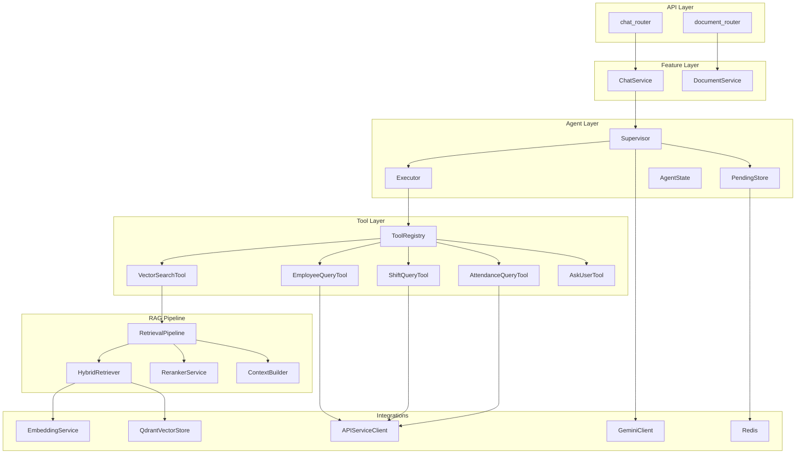

# 🔍 Agentic RAG — Full System Review

> Review dựa trên toàn bộ source code (50+ files), bao gồm agents, tools, RAG pipeline, integrations, API layer, và infrastructure.

---

## 1. Kiến trúc tổng thể



### Đánh giá: ✅ Tốt

- **Layered architecture** rõ ràng: API → Feature → Agent → Tool → Integration
- **Single Responsibility**: mỗi class có 1 nhiệm vụ rõ ràng
- **Dependency direction** chạy đúng chiều: layers trên depend layers dưới, không ngược
- **Per-request isolation**: ToolRegistry tạo mới mỗi request, bake `employee_id` vào tools tại construction time — security pattern tốt

---

## 2. Luồng ReAct

### Hiện trạng

```
User Message → Supervisor.run()
  ↓
  build system_prompt (1 lần) + scratchpad
  ↓
  LOOP: while !is_done && step_count < max_steps
    → _call_llm() → parse JSON {thought, action, action_input}
    → if action == "final_answer" → finish
    → if action == "ask_user" && count >= MAX → finish error
    → Executor.execute(action, action_input) → ToolResult
    → AgentState.add_step(step)
    → if is_ask_user → save pending → finish
  ↓
  if !is_done → finish_max_steps
  ↓
  sync_pending_state → return AgentState
```

### Đánh giá: ✅ Rất tốt

| Aspect | Assessment |
|---|---|
| Reason → Act → Observe loop | ✅ Đúng chuẩn ReAct paper |
| Thought field bắt buộc | ✅ Agent phải giải thích trước khi hành động |
| Max steps guard | ✅ Có, configurable qua settings |
| Ask_user count limit | ✅ `MAX_ASK_USER_COUNT = 2` |
| Pending state (multi-turn) | ✅ Redis-backed, TTL 30min |
| JSON parse resilience | ✅ `raw_decode` + trailing content tolerance |
| Scratchpad windowing | ✅ Chỉ giữ N steps gần nhất, tránh token bloat |

> [!TIP]
> Luồng ReAct được implement sạch và đúng. Supervisor chỉ own loop control + state. Executor own tool execution. Không có god-class.

---

## 3. Thiết kế Agent & khả năng mở rộng

### Điểm tốt

1. **Supervisor tách khỏi tool logic** — chỉ biết `ToolRegistry.get(name)` → chạy → nhận observation
2. **ToolRegistry per-request** — dễ add/remove tools theo context (role, feature flags)
3. **PromptBuilder tách khỏi Supervisor** — dễ swap prompt strategy
4. **Executor xử lý normalization** — tools chỉ cần trả `str` hoặc `ToolResult`

### Vấn đề cần cải thiện

#### 3.1 — Thiếu tool validation trước khi gọi LLM (Medium)

**Vấn đề**: LLM có thể trả `action` không tồn tại. Executor xử lý lỗi này, nhưng step vẫn bị đếm → lãng phí 1 iteration.

**Đề xuất**: Trong Supervisor, trước khi gọi Executor, validate action name:
```python
if action not in ("final_answer",) and action not in registry:
    # Inject error observation trực tiếp, không tốn 1 executor call
    state.add_step(AgentStep(
        thought=thought, action=action, action_input=action_input,
        observation=f"Tool '{action}' không tồn tại. Các tool có sẵn: {', '.join(registry.tool_names)}",
        is_error=True,
    ))
    continue
```

#### 3.2 — Multi-agent support chưa có nhưng kiến trúc mở (Low)

**Hiện tại**: 1 Supervisor = 1 agent. Chưa có router/orchestrator cho multi-agent.

**Nhận xét**: Đây không phải vấn đề ngay — kiến trúc hiện tại đủ tốt cho use case HR chatbot. Khi cần multi-agent, chỉ cần tạo `AgentRouter` wrap nhiều Supervisor với tool sets khác nhau.

---

## 4. Thiết kế 3 Tools

### Tổng quan

| Tool | Interface | Abstraction | Responsibility | Tái sử dụng |
|---|---|---|---|---|
| `VectorSearchTool` | ✅ `BaseTool` + `VectorSearchInput` | ✅ Delegate to `RetrievalPipeline` | ✅ Search + format citations | ✅ |
| `EmployeeQueryTool` | ✅ `BaseTool` + `EmployeeQueryInput` | ✅ Delegate to `APIServiceClient` | ✅ Fetch + format profile | ✅ |
| `ShiftQueryTool` | ✅ `BaseTool` + `ShiftQueryInput` | ✅ Delegate to `APIServiceClient` | ✅ Fetch + format shift | ✅ |
| `AttendanceQueryTool` | ✅ `BaseTool` + `AttendanceQueryInput` | ✅ Delegate to `APIServiceClient` | ✅ Fetch + format events | ✅ |
| `AskUserTool` | ✅ `BaseTool` + `AskUserInput` | ✅ Stateless signal | ✅ Generate signal | ✅ |

### Đánh giá: ✅ Tốt

- **Consistent interface**: Tất cả inherit `BaseTool` với `name`, `description`, `args_schema`, `run()`
- **Input validation**: Pydantic schema với `ConfigDict(extra="forbid")` — chặn LLM sinh field thừa
- **Security**: `employee_id` bake tại construction, không qua LLM
- **Formatter tách riêng**: `formatters.py` tập trung format logic, tools chỉ gọi

### Vấn đề cần cải thiện

#### 4.1 — API tools không trả `ToolResult`, chỉ trả `str` (Low)

**Vấn đề**: `EmployeeQueryTool`, `ShiftQueryTool`, `AttendanceQueryTool` return `str` thay vì `ToolResult`. Executor phải normalize. Mất cơ hội gắn metadata (ví dụ: `metadata={"source": "api-service"}`).

**Ảnh hưởng**: Nhỏ — Executor normalize đúng. Nhưng khi cần tracing chi tiết hơn (ví dụ: latency per-tool, API response status), sẽ thiếu.

#### 4.2 — `web_search_tool.py` file rỗng (Low)

**Nhận xét**: File tồn tại nhưng empty. Nên xóa hoặc thêm `TODO` comment để tránh confuse.

---

## 5. Prompt Engineering & Reasoning

### Đánh giá: ✅ Tốt (sau lần sửa trước)

| Aspect | Assessment |
|---|---|
| JSON format enforcement | ✅ Cực kỳ chi tiết, cả ví dụ đúng/sai |
| Tool routing strategy | ✅ Dynamic (đã sửa từ hardcode) |
| Multi-tool guidance | ✅ Có ví dụ multi-step |
| Error recovery | ✅ Có section riêng |
| Time reasoning | ✅ Có format hướng dẫn |
| Security guardrails | ✅ Section BẢO MẬT rõ ràng |
| Step budget hint | ✅ Warning khi còn ≤2 bước |
| Scratchpad management | ✅ Windowed, per-tool truncation limits |

### Vấn đề còn lại

#### 5.1 — `PromptMemoryConfig` defaults vs Settings defaults mismatch (Medium)

**Vấn đề**: [PromptMemoryConfig](file:///home/thanh-phuc/PycharmProjects/FaceAttendanceManagementSystem/agentic-rag/src/integrations/llm/prompts.py#L114-L118) defaults:
```python
window_steps: int = 3
default_observation_limit_chars: int = 2500
```

Nhưng [Settings](file:///home/thanh-phuc/PycharmProjects/FaceAttendanceManagementSystem/agentic-rag/src/core/settings.py#L19-L21) defaults:
```python
agent_prompt_window_steps: int = 2
agent_default_observation_limit_chars: int = 1000
```

Khi test không qua Settings (ví dụ unit test dùng `PromptMemoryConfig()` trực tiếp), sẽ có behavior khác production.

**Đề xuất**: Sync defaults giữa 2 nơi hoặc bỏ defaults trong `PromptMemoryConfig`, bắt buộc luôn init qua `from_settings()`.

#### 5.2 — Gemini JSON mode đã enforce JSON, prompt có thể bớt ví dụ SAI (Low)

**Nhận xét**: `GeminiClient.generate_json()` set `response_mime_type="application/json"` — Gemini API sẽ luôn trả JSON valid. Các ví dụ "SAI" trong prompt (text sau JSON, 2 JSON liên tiếp) chủ yếu phòng trường hợp model version cũ. Không cần xóa nhưng có thể rút gọn nếu cần giảm token.

---

## 6. Quản lý State, Memory & Context

### Đánh giá: ✅ Tốt

| Component | Implementation | Quality |
|---|---|---|
| `AgentState` | Dataclass, clear lifecycle methods | ✅ |
| `AgentStep` | Immutable trace per iteration | ✅ |
| `AgentPendingStore` | Redis, TTL 30min, JSON serialize | ✅ |
| Scratchpad windowing | Configurable `window_steps` | ✅ |
| Chat history windowing | Configurable `chat_history_window_messages` | ✅ |
| Per-tool truncation | `tool_observation_limits` dict | ✅ |
| Serialization round-trip | `to_pending_dict()` ↔ `from_pending_dict()` | ✅ |

### Vấn đề

#### 6.1 — Pending state resume không validate message continuity (Medium)

**Vấn đề**: Trong [_build_initial_state](file:///home/thanh-phuc/PycharmProjects/FaceAttendanceManagementSystem/agentic-rag/src/agents/supervisor.py#L192-L232), khi resume pending:
- Validate `employee_id` và `user_role` match ✅
- **Không validate** `conversation_id` match với pending state
- `resume_from_ask_user_answer()` giả định step cuối cùng là `ask_user` — nếu pending state bị corrupt, sẽ raise `ValueError`

**Ảnh hưởng**: Có try/catch bọc ngoài nên không crash, nhưng user experience bị ảnh hưởng (mất context).

#### 6.2 — Chat history không có token budget (Low-Medium)

**Vấn đề**: `chat_history_window_messages = 6` cắt theo số message, không theo token count. Nếu mỗi turn dài (ví dụ assistant trả 500 từ), 6 turns = ~3000 tokens chỉ cho history.

**Đề xuất**: Thêm `chat_history_max_chars` limit hoặc truncate mỗi turn content.

---

## 7. Error Handling, Retry, Timeout & Fallback

### Đánh giá: ⚠️ Trung bình-Tốt

| Scenario | Handling | Quality |
|---|---|---|
| LLM timeout | `asyncio.wait_for` + `LLMTimeoutError` | ✅ |
| LLM blocked response | `LLMBlockedError` | ✅ |
| LLM JSON parse fail | `json.JSONDecodeError` caught, log raw | ✅ |
| Tool not found | Executor returns error observation | ✅ |
| Tool runtime error | Executor catches, returns error observation | ✅ |
| Tool input validation | Pydantic `ValidationError` caught | ✅ |
| API service HTTP error | `httpx.HTTPStatusError` caught per-tool | ✅ |
| Redis failure | Graceful fallback (log + continue) | ✅ |
| LLM retry | ❌ **Không có** | ⚠️ |
| Tool retry | ❌ **Không có** | ⚠️ |
| Rate limiting | ❌ **Không có** | ⚠️ |

### Vấn đề

#### 7.1 — Không có LLM retry (High)

**Vấn đề**: `GeminiClient._call_once()` — tên hàm đã nói rõ: chỉ gọi 1 lần. Nếu Gemini trả lỗi transient (503, rate limit, network glitch), toàn bộ agent loop fail ngay.

**Ảnh hưởng**: Production sẽ gặp intermittent failures, đặc biệt khi traffic cao.

**Đề xuất**: Thêm exponential backoff retry (2-3 lần) cho transient errors:

```python
async def _call_with_retry(self, ..., max_retries: int = 3) -> LLMResponse:
    for attempt in range(max_retries):
        try:
            return await self._call_once(...)
        except LLMTimeoutError:
            if attempt == max_retries - 1:
                raise
            await asyncio.sleep(2 ** attempt)
        except LLMError as exc:
            if "429" in str(exc) or "503" in str(exc):
                if attempt == max_retries - 1:
                    raise
                await asyncio.sleep(2 ** attempt)
            else:
                raise
```

Hoặc dùng thư viện `tenacity`.

#### 7.2 — Chat endpoint expose internal error details (Medium)

**Vấn đề**: Trong [chat_router.py:L23-L29](file:///home/thanh-phuc/PycharmProjects/FaceAttendanceManagementSystem/agentic-rag/src/api/v1/chat_router.py#L23-L29):
```python
except Exception as exc:
    raise HTTPException(status_code=500, detail=str(exc)) from exc
```

`str(exc)` có thể chứa stack trace, API keys, internal paths.

**Đề xuất**: Trả message generic cho client, log detail server-side:
```python
except Exception as exc:
    logger.exception("Unhandled error in chat endpoint...")
    raise HTTPException(status_code=500, detail="Internal server error") from exc
```

---

## 8. Logging, Tracing & Debug

### Đánh giá: ✅ Tốt

| Feature | Implementation |
|---|---|
| Structured agent trace | ✅ Riêng file `agent_trace_*.log`, `log_agent_start/step/tool/finish` |
| System log | ✅ File `system_*.log` + console |
| Per-step raw output logging | ✅ `RAW_OUTPUT_PREVIEW_CHARS = 1200` |
| Tool dispatch/result logging | ✅ Có |
| Latency tracking | ✅ `duration_ms` trong LLM, retriever, reranker |
| Log rotation | ❌ Không có |

### Vấn đề

#### 8.1 — Log files không có rotation (Medium)

**Vấn đề**: Mỗi lần start tạo file mới (`system_2026-06-30_...log`). Nhưng không xóa file cũ. Disk sẽ đầy theo thời gian.

**Đề xuất**: Dùng `logging.handlers.RotatingFileHandler` hoặc `TimedRotatingFileHandler`, hoặc thêm cron job cleanup.

#### 8.2 — Agent trace thiếu conversation_id per-step (Low)

**Vấn đề**: `log_agent_step()` không nhận `conversation_id` — khó correlate steps với conversation khi debug multi-user concurrent.

---

## 9. Hiệu năng & Chi phí LLM

### Đánh giá: ✅ Tốt

| Optimization | Implementation |
|---|---|
| JSON mode (giảm token waste) | ✅ `response_mime_type="application/json"` |
| Temperature 0.0 cho reasoning | ✅ `generate_json(temperature=0.0)` |
| Scratchpad windowing | ✅ Chỉ giữ N steps, tránh prompt bloat |
| Per-tool truncation | ✅ `tool_observation_limits` |
| Embedding thread pool | ✅ `ThreadPoolExecutor(max_workers=1)` |
| Reranker thread pool | ✅ Riêng, tránh block event loop |
| Hybrid search (dense + sparse) | ✅ RRF fusion |
| Token counting (context budget) | ✅ tiktoken-based |
| Lost-in-middle reordering | ✅ `_lost_in_middle_order()` |

### Vấn đề

#### 9.1 — System prompt rebuild mỗi request (Low)

**Vấn đề**: `PromptBuilder.build_system_prompt()` format string mỗi lần `Supervisor.run()` gọi. Tool descriptions không đổi trong suốt app lifecycle (trừ khi thêm tool mới).

**Ảnh hưởng**: Negligible — string format rất rẻ. Nhưng nếu muốn optimize, có thể cache system prompt per-tool-set.

#### 9.2 — Embedding/Reranker single-worker bottleneck (Medium)

**Vấn đề**: Cả `EmbeddingClient` và `RerankerClient` dùng `ThreadPoolExecutor(max_workers=1)`. Concurrent requests sẽ queue.

**Nhận xét**: Đây là **intentional design** vì BGE-M3 và FlagReranker không thread-safe. Nếu cần throughput cao hơn, cần model serving layer riêng (Triton, TGI) hoặc multiple model instances.

---

## 10. Bảo mật & Validation

### Đánh giá: ✅ Tốt

| Aspect | Implementation |
|---|---|
| API key authentication | ✅ `X-API-Key` header, per-endpoint |
| Employee isolation | ✅ `employee_id` bake vào tools, LLM không biết |
| Role-based document access | ✅ `allowed_roles` filter trong Qdrant query |
| Pydantic input validation | ✅ Tất cả tool inputs, API schemas |
| Extra fields blocked | ✅ `ConfigDict(extra="forbid")` |
| Prompt injection defense | ✅ Security section trong system prompt |

### Vấn đề

#### 10.1 — API key comparison không timing-safe (Medium)

**Vấn đề**: Trong [dependenci.py:L18](file:///home/thanh-phuc/PycharmProjects/FaceAttendanceManagementSystem/agentic-rag/src/core/dependenci.py#L18):
```python
if api_key != settings.rag_api_key:
```

String comparison `!=` susceptible to timing attacks.

**Đề xuất**: Dùng `hmac.compare_digest()`:
```python
import hmac
if not hmac.compare_digest(api_key or "", settings.rag_api_key):
    raise HTTPException(status_code=403, detail="Invalid API key")
```

#### 10.2 — `format_api_error` có thể leak response body (Medium)

**Vấn đề**: Trong [errors.py:L14](file:///home/thanh-phuc/PycharmProjects/FaceAttendanceManagementSystem/agentic-rag/src/tools/api_queries/errors.py#L14):
```python
f"status={exc.response.status_code}, body={exc.response.text}"
```

`response.text` được inject vào tool observation → đi vào scratchpad → gửi cho LLM. Nếu api-service trả error chứa sensitive data, LLM có thể echo ra user.

**Đề xuất**: Chỉ giữ status code, bỏ body:
```python
f"api-service trả lỗi: status={exc.response.status_code}"
```

---

## 11. Chất lượng Code & Cấu trúc

### Đánh giá: ✅ Tốt

| Aspect | Assessment |
|---|---|
| Directory structure | ✅ Clean: agents / tools / rag / integrations / features / api |
| Naming conventions | ✅ Consistent snake_case, descriptive |
| Type hints | ✅ Gần như 100% coverage |
| `from __future__ import annotations` | ✅ Consistent |
| Docstrings | ⚠️ Có nhưng không đều — agents tốt, ingestion thiếu |
| Test coverage | ❌ `tests/` directory rỗng |
| Dead code | ⚠️ `web_search_tool.py` empty, `exceptions.py` empty |
| Import organization | ✅ Consistent |

### Vấn đề

#### 11.1 — Không có tests (High)

**Vấn đề**: `tests/` directory chỉ có `__pycache__`. Không có unit test, integration test nào.

**Ảnh hưởng**: Mọi refactor đều rủi ro. Không thể CI/CD an toàn.

**Đề xuất ưu tiên test**:
1. **Unit test Supervisor** — mock LLM + tools, test loop logic
2. **Unit test Executor** — test tool dispatch, error handling
3. **Unit test PromptBuilder** — test scratchpad, step budget
4. **Integration test ChatService** — test end-to-end flow
5. **Unit test RetrievalPipeline** — test quality filter, context building

#### 11.2 — Typo trong filename: `dependenci.py` (Low)

**Vấn đề**: Nên là `dependencies.py`.

#### 11.3 — `IngestionPipeline._validate_input` không được gọi trực tiếp (Low)

**Vấn đề**: `_validate_input` tồn tại nhưng được gọi bên trong `_load_documents`. Logic validation nên tách rõ khỏi loading, hoặc merge hẳn vào.

---

## Roadmap cải thiện → Production-Ready

### Phase 1 — Critical & High (1-2 tuần)

| # | Task | Priority | Effort |
|---|---|---|---|
| 1 | **Thêm LLM retry + backoff** cho transient errors | 🔴 High | Medium |
| 2 | **Viết test suite cơ bản** (Supervisor, Executor, PromptBuilder) | 🔴 High | High |
| 3 | **Ẩn internal errors** khỏi API response (chat_router, format_api_error) | 🟡 Medium | Low |
| 4 | **Timing-safe API key comparison** (`hmac.compare_digest`) | 🟡 Medium | Low |

### Phase 2 — Medium (2-4 tuần)

| # | Task | Priority | Effort |
|---|---|---|---|
| 5 | **Sync PromptMemoryConfig defaults** với Settings | 🟡 Medium | Low |
| 6 | **Log rotation** cho system + agent trace logs | 🟡 Medium | Low |
| 7 | **Chat history token budget** (truncate per-turn hoặc total) | 🟡 Medium | Medium |
| 8 | **Validate action name** trước Executor call trong Supervisor | 🟡 Medium | Low |
| 9 | **Thêm conversation_id** vào `log_agent_step` | 🟡 Medium | Low |

### Phase 3 — Polish (4+ tuần)

| # | Task | Priority | Effort |
|---|---|---|---|
| 10 | **API tools return `ToolResult`** thay vì `str` | 🟢 Low | Low |
| 11 | **Cleanup dead files** (`web_search_tool.py`, `exceptions.py`) | 🟢 Low | Trivial |
| 12 | **Rename `dependenci.py`** → `dependencies.py` | 🟢 Low | Trivial |
| 13 | **Rate limiting** cho chat endpoint | 🟢 Low | Medium |
| 14 | **Integration tests** (end-to-end với test Redis/Qdrant) | 🟢 Low | High |
| 15 | **Multi-agent router** (khi cần mở rộng agents) | 🟢 Low | High |

---

## Tổng kết

> [!IMPORTANT]
> Hệ thống được thiết kế **rất tốt** cho một agentic RAG chatbox ở giai đoạn hiện tại. Kiến trúc clean, separation of concerns rõ ràng, và security-first design (employee isolation, RBAC, prompt injection defense). Các vấn đề chủ yếu ở tầng **operational readiness** (retry, tests, log rotation) chứ không phải architectural flaws.

### Điểm mạnh nổi bật:
- ✅ ReAct loop implement đúng chuẩn, robust
- ✅ Security pattern xuất sắc (employee_id isolation, RBAC)
- ✅ RAG pipeline hoàn chỉnh (hybrid search → rerank → context build → citations)
- ✅ Async-first architecture, không block event loop
- ✅ Configurable via Settings, clean DI pattern
- ✅ Agent trace logging riêng biệt

### Cần cải thiện ngay:
- ❌ LLM retry cho production stability
- ❌ Test suite cho confidence khi refactor
- ❌ Không leak internal errors ra API response
